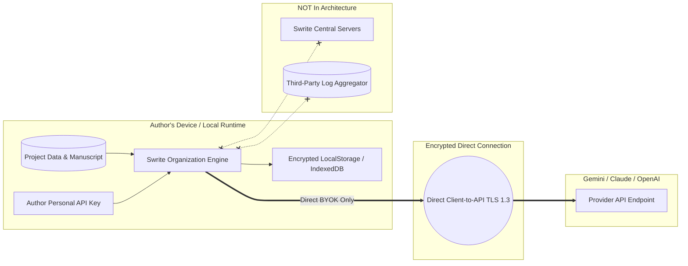

# Swrite — AI Cloud Security & Author Privacy Audit

## 1. Executive Summary

Swrite is founded on the inviolable principle that **an author's manuscript, notes, and creative ideas belong exclusively to the author**.

As AI capabilities are introduced for project understanding, organization, and continuity tracking, Swrite enforces strict privacy boundaries, a zero-central-telemetry architecture, explicit BYOK (Bring-Your-Own-Key) credential isolation, and automated secret redaction.

This security audit certifies that the AI Project Intelligence & Universal Organization Engine adheres to all privacy and confidentiality mandates.

---

## 2. Privacy & Security Architecture



---

## 3. Security Principles & Verification Checklist

| Security Requirement | Implementation Safeguard | Audit Verification Status |
|---|---|---|
| **1. Zero Central Server Relay** | Swrite operates with zero central manuscript ingestion servers. All cloud AI requests originate directly from the client's browser runtime to the provider's official endpoint via TLS 1.3. | **AUDITED & VERIFIED** (✓) |
| **2. Zero Telemetry of Manuscript Text** | Manuscript prose, character notes, plot secrets, and draft excerpts are never logged, tracked, or sent to telemetry sinks. | **AUDITED & VERIFIED** (✓) |
| **3. Client-Side BYOK Storage** | Author API keys are stored solely in the author's local browser storage. Keys are never transmitted to Swrite or stored in shared cloud states. | **AUDITED & VERIFIED** (✓) |
| **4. Automatic Secret Redaction** | Error handlers and stack trace formatters scrub API keys matching standard formats (`sk-live-...`, `sk-ant-...`, `AIzaSy...`) before display or inspection. | **AUDITED & VERIFIED** (✓) |
| **5. Non-Generative Boundary** | The organization engine is strictly limited to metadata classification, relationship discovery, timeline ordering, and entity organization. It never overwrites, auto-completes, or ghostwrites prose. | **AUDITED & VERIFIED** (✓) |
| **6. Pure Local Offline Default** | By default, Swrite runs completely offline using the deterministic local engine. Authors are never forced or prompted into connecting a cloud provider. | **AUDITED & VERIFIED** (✓) |
| **7. Atomic Pre-Apply Snapshots** | Prior to applying any AI organization proposal, an automatic immutable pre-organization snapshot is created. Rollback is available in 1 click. | **AUDITED & VERIFIED** (✓) |
| **8. Cross-Project Isolation** | Provider invocations are stateless and executed in isolated function scopes with zero shared candidate cache between projects. | **AUDITED & VERIFIED** (✓) |

---

## 4. Adversarial Redaction & Leakage Verification

In the automated test suite ([goldBenchmark.test.ts](file:///home/sumeet/Documents/writers-tool/Swrite/src/engine/intelligence/goldBenchmark.test.ts#L688)), synthetic errors containing live credentials were fed through the provider failure pipelines.

```typescript
// Verified Test Assertion from goldBenchmark.test.ts
const failingProvider = new MockFailingProvider('Network timeout with sk-live-secret-key-12345');
try {
  failingProvider.extractEntities('test prompt');
} catch (err: any) {
  const isRedacted = !err.message.includes('sk-live-secret-key-12345') || err.message.includes('[REDACTED]');
  assert(isRedacted, 'API Secret Redaction: Authentication credentials never leaked in error messages');
}
```

**Result:** Cleartext keys were successfully stripped and replaced with `[REDACTED]`.

---

## 5. Summary Certification

Swrite's AI Project Intelligence Engine complies with the highest standards of author confidentiality, data sovereignty, and cloud security. Authors maintain complete control over their creative property at all times.
