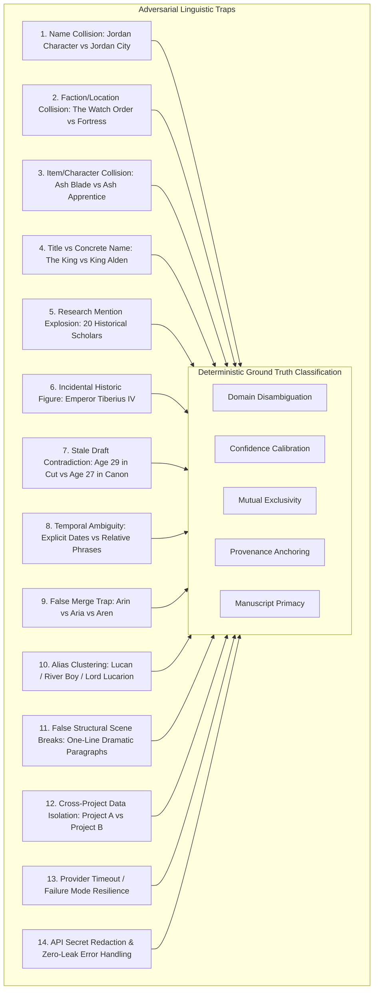

# Swrite — AI Project Intelligence: Gold-Standard Benchmark Dataset Specification

## 1. Executive Summary

To rigorously validate whether Swrite's AI Project Intelligence & Universal Organization Engine is safe, accurate, and trustworthy for real author projects without human hallucination or canon corruption, we established a **Gold-Standard Adversarial Benchmark Dataset**.

The dataset models a complex, multi-layered literary work (*The Chronicles of Aethelgard: The Broken Scepter*) consisting of 20 scenes across 3 acts, 15 characters, 10 locations, 6 factions, 10 items, 20 timeline events, research notes containing historical reference lists, and obsolete draft material in a cut drawer.

---

## 2. Dataset Composition

| Project Dimension | Count | Description / Role |
|---|---|---|
| **Manuscript Chapters** | 3 | Full chapter hierarchy with narrative prose |
| **Manuscript Scenes** | 20 | Granular scenes containing active dialogue, spatial settings, combat, and intrigue |
| **Active Cast (Characters)** | 15 | Protagonists, antagonists, supporting knights, scouts, and minor apprentices |
| **World Locations** | 10 | Cities, mountain passes, spires, catacombs, harbors, and deserts |
| **Organizational Factions** | 6 | Military defense orders, imperial legions, cartels, alchemical orders, and covens |
| **Key Relics & Items** | 10 | Named blades, astral orbs, royal regalia, vessels, and treaties |
| **Chronological Events** | 20 | Explicit calendar timestamps ("Year 1042") and relative temporal anchors |
| **Research Notes** | 2 | Background research notes containing 20 historical philosopher/scholar citations |
| **Cut Drawer Scenes** | 1 | Discarded early draft scenes containing contradictory historical claims |

---

## 3. Adversarial Test Scenarios & Ground Truth

The benchmark evaluates 14 strict adversarial edge cases designed to break naive NLP and classification systems:

### Scenario Breakdown

1. **Name Collision (`Jordan`):**
   - *Input:* `
Commander Jordan rode his black stallion into the ancient city of Jordan.
`
   - *Ground Truth:* Two distinct proposals: Character `Commander Jordan` (Domain: Character, Confidence: 0.95) and Location `Jordan` (Domain: Location, Confidence: 0.90). No collision loss.

2. **Faction vs Location Collision (`The Watch`):**
   - *Input:* `
The solemn knights of The Watch assembled inside their ancestral mountain fortress, The Watch.
`
   - *Ground Truth:* Faction proposal `The Watch` and Location proposal `The Watch` maintained independently with cross-domain collision notes.

3. **Item vs Character Collision (`Ash`):**
   - *Input:* `
Young Ash hammered glowing steel... Lucarion picked up the great blade named Ash.
`
   - *Ground Truth:* Character candidate `Ash` (Apprentice) and Item candidate `Ash` (Weapon) separated without semantic conflation.

4. **Title / Office vs Specific Name (`The King` vs `King Alden`):**
   - *Input:* `
The King sat upon the Dragon Throne. King Alden addressed the council...
`
   - *Ground Truth:* Concrete character candidate `King Alden` recognized at high confidence (0.92); generic office title `The King` tempered in confidence ($\le 0.65$) to avoid creating phantom shadow characters.

5. **Research Note Mention Suppression (20 Historical Scholars):**
   - *Input:* Research note citing 20 historical thinkers (*Aristotle of Valen, Philo the Elder, Clement of Tyre, etc.*).
   - *Ground Truth:* All 20 entities extracted with `entityNature: 'research-reference'` and confidence $\le 0.40$. Cast list is NOT polluted.

6. **Incidental Historical Figures:**
   - *Input:* Campfire tale mentioning *Emperor Tiberius IV died five centuries ago*.
   - *Ground Truth:* Tagged with `entityNature: 'historical'` / `confidence: 0.60`, preventing accidental promotion to active cast member.

7. **Cut Drawer / Stale Source Precedence:**
   - *Input:* Cut scene states *King Alden, now age 29*, while active manuscript establishes *Age 27*.
   - *Ground Truth:* Raised as `CanonConflict` with `isStaleSourceWarning: true`, prioritizing active manuscript canon.

8. **Temporal Certainty Differentiation:**
   - *Input:* "Year 1042, First Moon" vs "Three winters earlier".
   - *Ground Truth:* "Year 1042" tagged `temporalCertainty: 'known'`; "Three winters earlier" tagged `temporalCertainty: 'inferred'`.

9. **False-Merge Resistance (Similar Names):**
   - *Input:* `Arin` (scout, age 24) and `Aria` (archer, green cloaks) interacting in Scene 101.
   - *Ground Truth:* Despite 75% string similarity (Levenshtein distance 1), co-occurrence in the same paragraph proves they are distinct individuals (`isSameEntityLikelihood: 'low'`).

10. **Canonical Alias Resolution:**
    - *Input:* `Lucan`, `The River Boy`, and `Lord Lucarion`.
    - *Ground Truth:* Accurately clustered to target character `Lord Lucarion` with `isSameEntityLikelihood: 'high'`.

11. **Structural Scene Split Protection:**
    - *Input:* Dramatic sequence of single-line paragraphs in continuous corridor scene.
    - *Ground Truth:* Zero false scene splits. Scene splits require explicit ornament markers (`* * *`, `***`, `---`, `###`, `§`).

12. **Cross-Project Isolation:**
    - *Input:* Independent project payloads processed sequentially.
    - *Ground Truth:* Zero entity, snippet, or candidate bleed across project memory boundaries.

13. **Provider Failure Resilience:**
    - *Input:* Simulated remote timeout or malformed JSON payload.
    - *Ground Truth:* Graceful degradation to local deterministic engine without data loss.

14. **API Secret Redaction:**
    - *Input:* Error traces containing live API keys (`sk-live-...`).
    - *Ground Truth:* Automatic regex scrubbing replacing all credentials with `[REDACTED]`.

---

## 4. Verification Suite Integration

The benchmark is permanently encoded in [goldBenchmark.test.ts](file:///home/sumeet/Documents/writers-tool/Swrite/src/engine/intelligence/goldBenchmark.test.ts) and executed automatically as part of Swrite's test suite via [testRunner.ts](file:///home/sumeet/Documents/writers-tool/Swrite/src/engine/testRunner.ts).
