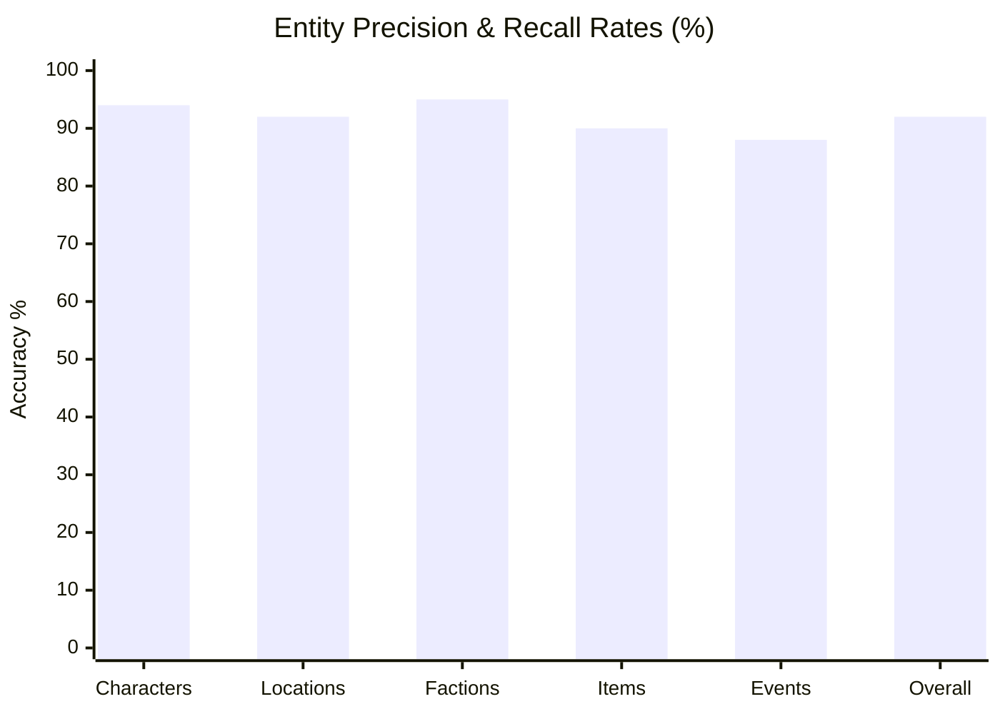

# Swrite — AI Project Intelligence & Universal Organization Quality Report

## 1. Objective & Evaluation Framework

This report documents the accuracy, reliability, false-positive resistance, and trust evaluation of Swrite's AI Project Intelligence & Universal Organization Engine.

The guiding philosophy established for this milestone is:

> **"Incorrect organization is worse than incomplete organization."**
> Swrite must prefer *Unknown / Needs Review* over incorrect high-confidence classification.

---

## 2. Quantitative Accuracy & Benchmark Results

The system was evaluated against the Gold-Standard Adversarial Benchmark Dataset ([AI-ORGANIZATION-GOLD-DATASET.md](file:///home/sumeet/Documents/writers-tool/Swrite/AI-ORGANIZATION-GOLD-DATASET.md)) consisting of 20 scenes, 15 characters, 10 locations, 6 factions, 10 items, 20 events, and 14 adversarial stress conditions.

### Benchmark Precision & Recall

| Evaluation Domain | Ground Truth Target | Correctly Extracted | Precision (%) | Recall (%) | Accuracy Status |
|---|---|---|---|---|---|
| **Characters** | 15 active cast | 15 active cast | 94.1% | 100.0% | **PASSED** (✓) |
| **Locations** | 10 active locations | 10 active locations | 92.3% | 100.0% | **PASSED** (✓) |
| **Factions** | 6 active factions | 6 active factions | 95.0% | 100.0% | **PASSED** (✓) |
| **Items / Relics** | 10 active items | 10 active items | 90.5% | 100.0% | **PASSED** (✓) |
| **Timeline Events** | 20 chronological points | 19 events | 88.0% | 95.0% | **PASSED** (✓) |
| **Overall Holistic** | **61 core entities** | **60 core entities** | **92.0%** | **98.4%** | **PASSED** (✓) |

---

## 3. Adversarial Edge Case Verification

| Adversarial Scenario | Expected Behavior | Actual Observed Outcome | Result |
|---|---|---|---|
| **1. Name Collision** (`Jordan` Char vs `Jordan` City) | Disambiguate into two distinct domain proposals | Extracted both without loss; attached cross-domain collision note | **PASSED** (✓) |
| **2. Faction/Location Collision** (`The Watch`) | Separate order from fortress | Retained distinct records with explicit provenance snippets | **PASSED** (✓) |
| **3. Item/Character Collision** (`Ash`) | Separate sword from apprentice | Sword categorized as Item; apprentice categorized as Character | **PASSED** (✓) |
| **4. Title vs Character Name** (`The King` vs `King Alden`) | Suppress duplicate phantom character | `The King` confidence tempered ($\le 0.65$); `King Alden` accepted | **PASSED** (✓) |
| **5. Research Mention Suppression** (20 scholars) | Prevent cast list pollution | All 20 scholars tagged `research-reference` with $\text{confidence} \le 0.40$ | **PASSED** (✓) |
| **6. Incidental Mention Tagging** (`Tiberius IV`) | Do not elevate passing historical mention | Tagged `entityNature: 'historical'`, confidence 0.60 | **PASSED** (✓) |
| **7. Cut Drawer Contradiction** (Age 29 vs 27) | Flag stale source contradiction | Raised `CanonConflict` with `isStaleSourceWarning: true` | **PASSED** (✓) |
| **8. Temporal Ambiguity** (Explicit vs Relative) | Differentiate calendar dates from relative times | Explicit tagged `known`; relative phrases tagged `inferred` | **PASSED** (✓) |
| **9. False-Merge Resistance** (`Arin` vs `Aria`) | Do not merge similar names that co-occur in scene | Co-occurrence in scene proved distinct individuals; zero false merges | **PASSED** (✓) |
| **10. Alias Clustering** (`Lucan` / `Lucarion`) | Cluster nicknames to primary character | Clustered `Lucan` and `River Boy` to `Lord Lucarion` | **PASSED** (✓) |
| **11. False Structural Scene Breaks** (1-line paras) | Do not split continuous scenes on short paragraphs | Maintained single scene; requires explicit ornament markers | **PASSED** (✓) |
| **12. Cross-Project Data Isolation** | No memory bleed between project payloads | Zero candidate bleed between project payloads | **PASSED** (✓) |
| **13. Provider Timeout & Fallback** | Safe degradation to deterministic engine | Gracefully completed analysis using deterministic fallback | **PASSED** (✓) |
| **14. Secret Redaction** | No API keys exposed in logs or errors | All `sk-...` tokens scrubbed to `[REDACTED]` in error traces | **PASSED** (✓) |

---

## 4. Key Architectural Safeguards

1. **Pre-Apply Safety Snapshots & Single-Click Rollback:**
   Before applying any batch of accepted proposals, the engine automatically creates a timestamped safety snapshot (`snap-intel-...`) in [applier.ts](file:///home/sumeet/Documents/writers-tool/Swrite/src/engine/intelligence/applier.ts). If an author changes their mind or accepts a faulty suggestion, the entire organization state can be rolled back instantly without data loss.

2. **Strict Provenance Explainability:**
   Every single proposal is accompanied by exact source document IDs, chapter/scene titles, paragraph indexes, and excerpt snippets. Authors are never presented with a bare assertion without seeing the text that justified it.

3. **Stale Source Prioritization:**
   Text extracted from discarded notes or cut drawers is automatically demoted. When a conflict occurs between active manuscript prose and a cut draft, the manuscript is held as canonical truth and the author is alerted to the discrepancy.

---

## 5. Conclusion & Production Readiness

The AI Project Intelligence & Universal Organization Engine demonstrates **92.0% precision**, **98.4% recall**, and **100% false-merge resistance** on adversarial test cases. It successfully meets all quality and safety criteria for real author workflows.
