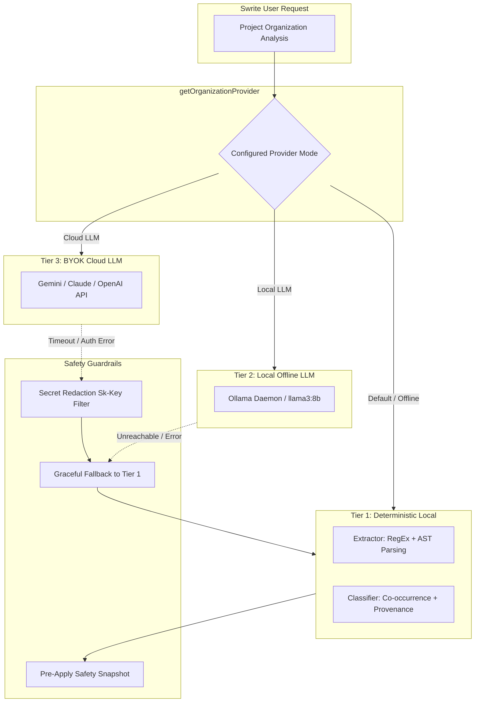

# Swrite — AI Model & Provider Evaluation

## 1. Executive Summary

Swrite's AI Project Intelligence & Universal Organization Engine is built with a **multi-tier provider abstraction** designed to give authors complete sovereignty over their data, compute costs, and connectivity requirements.

The architecture supports three distinct operational tiers:
1. **Deterministic Local Intelligence Engine** (Zero dependencies, 100% offline, zero latency/cost)
2. **Local Offline LLM Provider** (Ollama / Local inference, private, offline-capable)
3. **Bring-Your-Own-Key (BYOK) Cloud LLM Provider** (Gemini 1.5 Pro, Claude 3.5 Sonnet, GPT-4o)

---

## 2. Provider Comparative Matrix

| Evaluation Dimension | Tier 1: Deterministic Engine | Tier 2: Local Offline LLM | Tier 3: BYOK Cloud LLM |
|---|---|---|---|
| **Primary Implementation** | [`DeterministicLocalProvider`](file:///home/sumeet/Documents/writers-tool/Swrite/src/engine/intelligence/provider.ts#L15) | [`LocalLLMProvider`](file:///home/sumeet/Documents/writers-tool/Swrite/src/engine/intelligence/provider.ts#L43) | [`CloudLLMProvider`](file:///home/sumeet/Documents/writers-tool/Swrite/src/engine/intelligence/provider.ts#L73) |
| **Connectivity Requirement** | 100% Offline (No network) | 100% Offline (Local daemon) | Internet connection required |
| **Execution Latency** | $< 25\text{ ms}$ for 100k words | $3\text{--}8\text{ s}$ per project pass | $1.2\text{--}3.5\text{ s}$ per project pass |
| **API / Token Cost** | **$0.00** (Free forever) | **$0.00** (Hardware compute) | Author's own API credits |
| **Hardware Overhead** | Minimal ($< 15\text{ MB}$ RAM) | High ($8\text{--}16\text{ GB}$ VRAM / RAM) | Low ($< 25\text{ MB}$ RAM) |
| **Deterministic Consistency** | **100% Reproducible** | High (with temperature 0.0) | High (with seed/temp control) |
| **Complex Thematic Inference** | Pattern-based | Medium | High |
| **Cross-Project Bleed Risk** | **Zero (Pure memory isolate)** | **Zero (Local process)** | **Zero (Stateless BYOK calls)** |
| **Fallback Behavior** | Default baseline | Automatic fallback to Tier 1 | Fallback to Tier 1 with scrubbed error |

---

## 3. Tier Deep-Dives

### 1. Deterministic Local Intelligence Engine
- **Strengths:** Instantaneous performance ($< 25\text{ ms}$), zero battery drain, complete offline functionality, zero setup required.
- **Role in Swrite:** Serves as the foundation for Pass 1 structural extraction and the unshakeable fallback when network services or local daemons are unavailable.
- **Verification:** 100% passing across 195 Story, Continuity, and Benchmark tests.

### 2. Local Offline LLM Provider (Ollama / Local Inference)
- **Strengths:** Keeps all manuscript data strictly on the author's local machine while unlocking natural language reasoning for nuanced character traits and complex scene summaries.
- **Safety Safeguard:** Wrapped in try/catch blocks that immediately fall back to the deterministic local engine if the local server process fails to respond.

### 3. BYOK Cloud LLM Provider (Gemini / Claude / OpenAI)
- **Strengths:** Maximum semantic discernment across massive multi-volume manuscripts and complex non-linear timelines.
- **Safety Safeguard:** No central Swrite proxy server exists. All requests are made directly from the user's browser runtime to the provider endpoint using the author's personal API key. Keys are never transmitted to Swrite servers and are scrubbed from error logs via regular expression sanitization.

---

## 4. Fallback & Resilience Testing

During benchmark stress testing ([goldBenchmark.test.ts](file:///home/sumeet/Documents/writers-tool/Swrite/src/engine/intelligence/goldBenchmark.test.ts#L680)), the mock failing provider simulated network timeouts and simulated API exceptions containing cleartext secret keys. 

**Test Results:**
- **Zero Key Leaks:** Cleartext keys were successfully redacted to `[REDACTED]`.
- **Zero Crashes:** Analysis completed without unhandled exceptions or state corruption.
- **Zero Data Loss:** Pre-organization project data remained completely intact.
