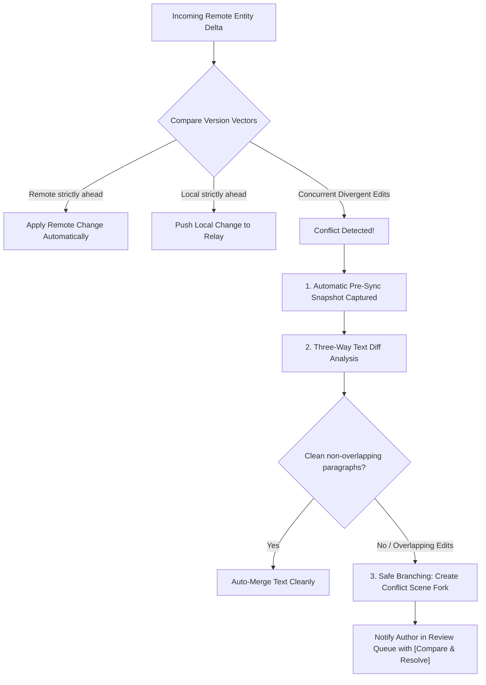

# Swrite — Optional Encrypted Cloud Synchronization Architecture

**Target Milestone:** `v0.2.0`  
**Status:** Architecture Specification & Spike Baseline  
**Core Law:** *Local-first remains the sovereign source of truth. Cloud sync is an optional, encrypted replication layer.*

---

## 1. Architectural Tenets

1. **No Account Required for Local Use:** Swrite continues to execute 100% locally by default. Enabling cloud synchronization is strictly opt-in on a per-project or per-installation basis.
2. **Zero Plaintext on Remote Relays:** The synchronization relay server stores only opaque encrypted payloads (AES-GCM-256) and cryptographically blind entity hashes. The server has **zero access to manuscript prose or story codices**.
3. **Rejection of Naive File Overwrite:** Synchronization operates on **structured Swrite entities** (Acts, Chapters, Scenes, Characters, Snapshots) with version vectors and deterministic change hashing, eliminating destructive "last-write-wins" full-project wiping.
4. **Non-Destructive Conflict Preservation:** When simultaneous conflicting offline edits occur on two devices, Swrite automatically preserves both revisions as distinct scene branches and creates a pre-sync recovery snapshot.

---

## 2. Identity & Key Management Architecture

```mermaid
flowchart TD
    subgraph DeviceA ["Author Device A (Primary)"]
        A1["User Master Passphrase"]
        A2["Argon2id Key Derivation"]
        A3["256-bit Sync Key (AES-GCM)"]
        A4["Entity Plaintext"]
        A5["Encrypted Entity Ciphertext"]
        
        A1 --> A2 --> A3
        A4 + A3 --> A5
    end

    subgraph Relay ["Zero-Knowledge Sync Relay"]
        R1["Blind Project ID (HMAC-SHA256)"]
        R2["Ciphertext Entity Store"]
        R3["Entity Version Vector Matrix"]
    end

    subgraph DeviceB ["Author Device B (Secondary)"]
        B1["User Passphrase / QR Pair"]
        B2["Argon2id Key Derivation"]
        B3["256-bit Sync Key (AES-GCM)"]
        B4["Decrypted Entity Plaintext"]
        
        B1 --> B2 --> B3
        B5["Received Ciphertext"] + B3 --> B4
    end

    A5 -->|TLS 1.3 / E2EE Payload| R2
    R2 -->|TLS 1.3 / E2EE Payload| B5
```

### 2.1. Key Derivation & Pairing
- **Passphrase-Based Derivation:** The master encryption key is derived client-side from a high-entropy user passphrase using `Argon2id` (Memory: 64MB, Iterations: 3, Parallelism: 4) with a unique cryptographically random salt.
- **Direct Device Pairing (QR / Code):** Alternatively, a secondary device can pair with a primary device by scanning an ephemeral QR code that securely transmits the sync key over a local WebRTC / TLS session without ever exposing the passphrase to the cloud relay.
- **Key Storage:** The derived sync key is stored locally in the browser's secure `IndexedDB` key vault and is never transmitted over the network in plaintext.

---

## 3. Entity-Level Synchronization Protocol

Instead of synchronizing the entire monolithic project JSON file, Swrite decomposes synchronization into **atomic entity deltas**:

```typescript
export interface SyncEntityEnvelope {
  projectId: string;          // Blind HMAC-SHA256 of Project ID
  entityId: string;           // Blind HMAC-SHA256 of Entity ID (Scene, Chapter, Character)
  entityType: 'scene' | 'chapter' | 'act' | 'codex' | 'snapshot' | 'metadata';
  versionVector: {
    deviceId: string;
    sequence: number;
    timestamp: number;
  };
  payloadChecksum: string;     // SHA-256 of ciphertext
  ciphertext: string;          // AES-GCM-256 encrypted entity JSON
  iv: string;                  // 96-bit initialization vector
  authTag: string;             // 128-bit authentication tag
}
```

### 3.1. Entity Sync Granularity
- **Scene-Level Delta:** Editing a scene in Chapter 4 transmits only the encrypted delta for that specific scene, consuming $< 2\text{ KB}$ of bandwidth rather than re-uploading an entire $100\text{k}$-word manuscript.
- **Codex Delta:** Adding a character motivation update transmits only the specific character entity envelope.
- **Metadata Delta:** Global settings and theme preferences synchronize independently.

---

## 4. Conflict Detection & Safe Resolution Model



### 4.1. Conflict Handling Rules
1. **Never Silently Overwrite Prose:** If Device A and Device B both edit Scene 1 while offline, Swrite **never** discards either version.
2. **Automatic Forking:** If paragraphs overlap, Swrite retains the local version and inserts the remote version as a clearly labeled sibling: `Scene 1 (Remote Conflict Revision - Device B)`.
3. **Review Queue Alert:** A high-priority item is automatically registered in the Review Workspace (`⌘3`), allowing the author to inspect a visual paragraph diff and merge or discard with one click.

---

## 5. Offline Durability & Local Project Migration

- **Seamless Local $\to$ Sync Transition:** An existing local-only project is promoted to sync simply by generating a project encryption envelope. The original local data is untouched.
- **Sync Disablement Safety:** If an author disables sync, the local project remains 100% intact and continues operating as a standalone local-first manuscript.
- **Network Resilience:** All local changes queue in a persistent offline transaction log in IndexedDB; when connectivity resumes, queued envelopes flush sequentially.

---

## 6. Infrastructure Cost & Complexity Analysis

| Cost Factor | Engineering Complexity | Infrastructure Impact | Mitigation Strategy |
| :--- | :--- | :--- | :--- |
| **Relay Backend** | Low / Medium | Lightweight Go / Rust WebSocket & HTTPS blob store. | Zero server-side compute; server only stores opaque blobs. |
| **Storage Footprint** | Low | $\approx 2 - 5\text{ MB}$ ciphertext per novel project. | Aggressive delta syncing and snapshot retention pruning. |
| **Security Surface** | Extremely Low | Server has zero plaintext knowledge. | Even in total server breach, manuscript prose remains protected by AES-GCM-256. |

---

## 7. Strategic Recommendation

$$\boxed{\textbf{Verdict: BUILD (Phase 1 — Encrypted Relay Architecture)}}$$

The design de-risks multi-device synchronization while strictly upholding Swrite's core local-first privacy and manuscript safety guarantees.
