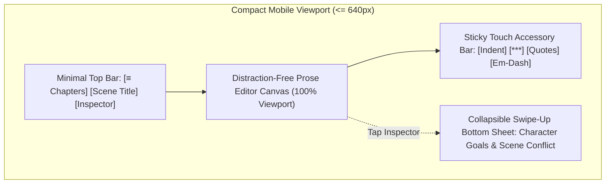

# Swrite — Responsive Mobile Drafting Architecture Specification

**Target Milestone:** `v0.2.0`  
**Status:** Architecture Specification & Spike Baseline  
**Core Goal:** *Excellent mobile drafting, not desktop Swrite squeezed onto a phone.*

---

## 1. Responsive Philosophy & Mobile Scope

Swrite Mobile focuses strictly on the highest-value mobile workflow:

$$\boxed{\textbf{Open Project} \quad\longrightarrow\quad \textbf{Select Chapter} \quad\longrightarrow\quad \textbf{Select Scene} \quad\longrightarrow\quad \textbf{Write Prose}}$$

Desktop capabilities that create high cognitive overhead on small screens (e.g. dense universe relationship graphs, full multi-track beat sheets, complex book print compilers) are cleanly hidden or simplified on mobile viewports.

---

## 2. Viewport Breakpoints & Adaptive Layouts

| Breakpoint Tier | Viewport Width | Navigation Mode | Inspector Presentation | Editor Layout |
| :--- | :--- | :--- | :--- | :--- |
| **Compact Mobile** | $\le 640\text{px}$ (iPhone, Android) | Collapsible Drawer / Stack Navigation | Swipeable Bottom Sheet (`h-60`) | Full-Width Single Column |
| **Tablet / Foldable** | $641\text{px} - 1024\text{px}$ (iPad, Foldables) | Slim Icon Rail + Slideout Drawer | Collapsible Right Margin (`w-64`) | Single Column with Margins |
| **Desktop / Laptop** | $> 1024\text{px}$ | Full Multi-Workspace Top Header | Resizable Margin Inspector (`w-80`) | Dual Continuous & Paginated 6"×9" |



---

## 3. Touch-First Drafting & Keyboard Adaptation

### 3.1. Virtual Keyboard Height & Viewport Resizing
- **Interactive Viewport Resizing:** Using the CSS `dvh` (Dynamic Viewport Height) unit and Visual Viewport API (`window.visualViewport`), the editor canvas dynamically resizes when the software keyboard opens, keeping the active cursor line centered and avoiding keyboard obstruction.
- **Sticky Touch Accessory Bar:** A 36px bar sits immediately above the virtual keyboard providing one-touch novel shortcuts:
  - `[⇥ Indent]` Insert 1.5em paragraph indent
  - `[⁂ Break]` Insert centered ornament scene break (`* * *`)
  - `[— Dash]` Insert typographical dialogue em-dash
  - `[“ ” Quote]` Insert matching curly dialogue quotes

### 3.2. Bottom-Sheet Contextual Inspector
- Instead of a vertical sidebar consuming 50% of the phone screen, tapping the character or scene badge slides up an **ergonomic bottom sheet**.
- Allows authors to check a character's eye color, active goal, or secret with one thumb swipe, and dismiss it instantly to resume typing.

---

## 4. Shared Engine Boundaries

```
┌────────────────────────────────────────────────────────┐
│                   Shared Swrite Core                   │
│  (StoryEngine, StorageService, IndexedDB, Typo/Theme)  │
└───────────────────────────┬────────────────────────────┘
                            │
            ┌───────────────┴───────────────┐
            ▼                               ▼
┌───────────────────────┐       ┌───────────────────────┐
│ Desktop UI Workspace  │       │ Responsive Mobile UI  │
│ - Paginated Book View │       │ - Fullscreen Editor   │
│ - Plan Matrix Grid    │       │ - Touch Accessory Bar │
│ - Publication Studio  │       │ - Bottom Sheet Drawer │
└───────────────────────┘       └───────────────────────┘
```

- **Zero Core Duplication:** The underlying data models, storage schemas, and story engine queries remain 100% identical between desktop and mobile.
- **Progressive Web App (PWA):** Mobile distribution runs as an offline-capable PWA with local service worker caching, installable directly to the home screen.

---

## 5. Strategic Recommendation

$$\boxed{\textbf{Verdict: BUILD (Phase 1 — Responsive Mobile Drafting & PWA)}}$$

Focusing exclusively on distraction-free drafting makes mobile development fast, low-risk, and immediately useful to traveling writers.
