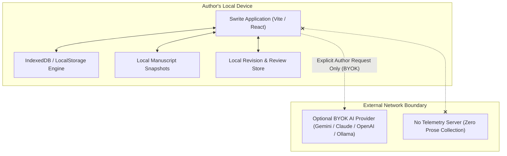

# Swrite — Privacy Architecture & Data Governance Specification

**Version:** `v0.1.0` (Stable)  
**Status:** Canonical Reference Architecture  

---

## 1. Core Privacy Tenet

Swrite is engineered on a strict **local-first, zero-surveillance architecture**:

$$\textbf{Author Device} \quad\Longleftrightarrow\quad \textbf{Local Storage (IndexedDB / LocalStorage)}$$

The author's manuscript prose, character profiles, story beats, timeline events, revision history, and editorial notes reside **exclusively on the author's local machine**.

---

## 2. Data Storage Boundaries

### 2.1. Local Persistence Layer
- **Storage Technology:** Browser `IndexedDB` and `localStorage` APIs.
- **Key Partitioning:**
  - `swrite_active_project_data`: Canonical project JSON including acts, chapters, scenes, and relational codex.
  - `swrite_user_theme_pref`: Visual theme token preferences.
  - `swrite_user_typo_pref`: Typographic configuration (font family, line height, paragraph indentation).
- **Offline Guarantee:** Swrite executes with 100% operational fidelity in full offline mode (airplane mode, disconnected environments).

### 2.2. Zero Manuscript Telemetry
- **No Remote Tracking:** Swrite does **not** transmit manuscript text, chapter titles, scene synopses, character names, or editorial notes to any external telemetry, analytics, or logging server.
- **Local Lifecycle Counters:** Only privacy-safe local session counters (e.g. `session_count`, `local_scene_count`) are maintained within local storage for client-side diagnostics.

---

## 3. Optional AI Infrastructure Boundary

Swrite treats AI strictly as **optional, author-invoked external infrastructure**:
- **Bring-Your-Own-Key (BYOK):** Users provide their own direct API credentials (e.g. Google Gemini, Anthropic Claude, OpenAI, or Local Offline Ollama).
- **Direct Client-to-API Communication:** Requests originate directly from the author's browser client to the chosen provider's API endpoint over HTTPS. Swrite operates **zero intermediate proxy servers** that intercept, log, or inspect prompts.
- **Explicit Triggering:** No text is sent to an AI provider automatically or in the background. AI critique, voice analysis, or brainstorming actions execute solely upon manual button click.

---

## 4. Export & Artifact Sanitization

When compiling manuscripts in the Publication Studio (PDF, DOCX, EPUB 3, Markdown):
- **Visual Separation:** Editor dark themes, custom canvas background colors, and margin annotation markers are strictly stripped during publication rendering.
- **Metadata Control:** Only author-specified metadata (Title, Author Name, Genre, Copyright, Year) is embedded in the exported artifact.
- **Local Packaging:** EPUB 3 zip compression, PDF vector layout, and DOCX document creation are performed entirely inside the local browser JavaScript engine without server-side processing.

---

## 5. Future Cloud Sync Privacy Boundary (v0.2 Foundation)

When optional cloud synchronization is enabled in future releases:
- **Client-Side Encryption (E2EE):** Manuscript entities will be encrypted on-device before transmission using AES-GCM-256 with keys derived from a user passphrase via Argon2id / PBKDF2.
- **Zero-Knowledge Remote Server:** The synchronization relay server will store only opaque ciphertext blobs and cryptographically hashed entity IDs. The server will have zero mathematical access to plaintext prose.
