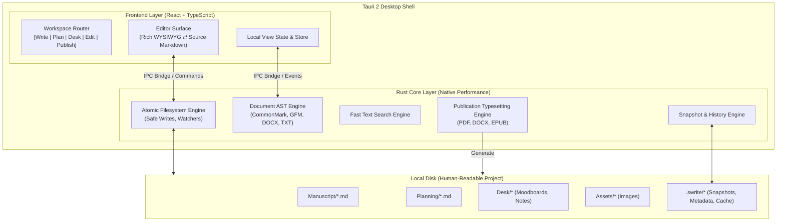

# Swrite 2 — Architectural Decision Records (ADRs)

**Document Version:** 1.0.0  
**Status:** Canonical & Locked  
**Milestone:** 0 — Product Contract  

---

## 1. Architectural Overview

Swrite 2 is structured as a high-performance desktop application where **the local filesystem is the authoritative source of truth**, and the user interface acts as an ergonomic, distraction-free projection over those files.



---

## 2. Architecture Decision Records

### ADR-001: Adoption of Tauri 2 and Native Rust Core
- **Context**: Electron applications suffer from high memory footprint, sluggish cold startup, and massive bundle sizes. Writing software must be instantaneous and lightweight.
- **Decision**: Build Swrite 2 on **Tauri 2** using a native **Rust Core** paired with a **React + TypeScript** webview UI.
- **Responsibilities**:
  - **Rust Core**: Filesystem I/O, atomic writes, file watching, heavy text parsing, search indexing, PDF/DOCX compilation, snapshot storage.
  - **React Frontend**: Editor canvas, keyboard interaction, slash command menus, moodboard drag-and-drop, UI state.
- **Consequences**: Minimal memory usage (<60MB idle), sub-second cold starts, native OS dialogs, and bulletproof filesystem security.

---

### ADR-002: Filesystem-First Data Architecture (Files as Source of Truth)
- **Context**: Proprietary database formats (SQLite, Realm, custom binary files) cause vendor lock-in, corruption risks, and opaque backups.
- **Decision**: A Swrite project is a plain directory on the user's hard drive.
  - Every chapter/scene is a `.md` or `.txt` file.
  - Every note and outline beat is stored in clean Markdown.
  - Reference images reside in `Assets/`.
  - Internal application metadata lives in a hidden `.swrite/` folder.
- **Consequences**:
  - The author can inspect or edit their manuscript using standard operating system tools (VS Code, Obsidian, Finder) with zero lock-in.
  - Copying the folder creates an instant, complete backup.

```text
My Novel Project/
├── Manuscript/
│   ├── Act 1/
│   │   ├── 01 - The Opening Gate.md
│   │   └── 02 - Whispers in the Fog.md
│   └── Act 2/
│       └── 01 - The Sunken Tower.md
├── Planning/
│   ├── Outline.md
│   ├── Timeline.md
│   └── Character Sketches.md
├── Desk/
│   ├── Moodboard - The Capital.json
│   └── Research Notes.md
├── Assets/
│   └── map_ancient_realm.png
└── .swrite/
    ├── project.json       (UI state, theme, view settings)
    └── snapshots/         (Automatic crash recovery checkpoints)
```

---

### ADR-003: Bidirectional Dual-Model Editor (Rich WYSIWYG & Markdown Source)
- **Context**: Authors want the elegance of formatted prose (italics, headings, indentation) but frequently need the speed and precision of raw Markdown syntax.
- **Decision**: Implement a dual-mode editor synchronized via an abstract syntax tree (AST).
  - Switching between Rich Mode and Markdown Source Mode is instantaneous and lossless.
  - Unknown Markdown extensions or HTML comments are preserved without destruction.
- **Consequences**: Writers have complete freedom without ever worrying about format corruption.

---

### ADR-004: Atomic, Safe-by-Design Persistence Strategy
- **Context**: File writes during power cuts, OS sleep cycles, or unexpected crashes can cause file truncation (0-byte corrupted files).
- **Decision**:
  1. **Write-to-Temp-and-Rename**: Changes are written to a temporary sibling file (`.filename.tmp`), flushed to disk (`fsync`), and atomically renamed over the target file.
  2. **Automatic Snapshots**: On every major milestone (chapter change, periodic save, manual backup), Swrite stores rolling snapshots in `.swrite/snapshots/`.
- **Consequences**: Zero chance of partial file corruption; corrupted project states are mathematically prevented.

---

### ADR-005: Decoupling Publication Engine from Editor Themes
- **Context**: In typical writing apps, writing in dark mode or choosing a quirky font inadvertently affects exports.
- **Decision**: The **PUBLISH** environment utilizes dedicated, standalone publication stylesheets and geometry settings (6×9 Paperback, Letter, A5, Shunn Manuscript, Standard EPUB) that are completely isolated from the editor's screen theme.
- **Consequences**: An author can write in a green-on-black terminal theme while exporting an exquisite, print-ready Garamond paperback.

---

### ADR-006: Hidden-File Discipline & Clean Workspace
- **Context**: Internal cache files, history trees, and index databases clutter folder navigation and confuse authors.
- **Decision**: All application-internal files begin with a dot (`.swrite/`, `.history/`, `.cache/`).
  - Swrite's internal file browser strictly filters and hides all dotfiles by default.
  - The project binder always looks clean and literary.
- **Consequences**: No visual junk in the author's primary workspace.

---

### ADR-007: Future Plugin Architecture Boundary (Post-MVP)
- **Context**: Extensibility is valuable long-term, but building a plugin engine in MVP creates architectural churn.
- **Decision**: Define clear conceptual plugin boundaries now, but implement zero plugin infrastructure in MVP:
  - Extension points: Custom Exporters, Custom Themes, Custom Slash Commands, Side Panels.
  - Execution model: Sandboxed Web Worker / WASM with explicit, author-granted filesystem permissions.
- **Consequences**: The core architecture remains clean, unencumbered by premature plugin abstraction.

---

### ADR-008: Absolute Exclusion of AI and Cloud Synchronizers
- **Context**: AI toolchains and cloud syncing introduce external network dependencies, latency, privacy risks, and architectural instability.
- **Decision**: Swrite 2 has zero AI dependencies and zero cloud servers. The entire application runs 100% offline.
- **Consequences**: Instantaneous responsiveness, total author privacy, zero telemetry, and permanent local durability.
