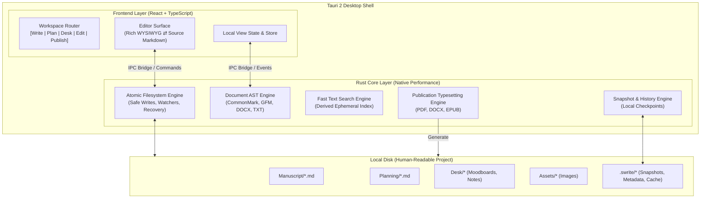

# Swrite 2 — Architectural Decision Records (ADRs)

**Document Version:** 1.0.0  
**Status:** Canonical & Locked  
**Milestone:** 1 — Document Model & Filesystem Specification  

---

## 1. Architectural Overview

Swrite 2 is structured as a high-performance desktop application where **the local filesystem is the authoritative source of truth**, and the user interface acts as an ergonomic, distraction-free projection over those files.

---

## 2. Architecture Decision Records

### ADR-001: Adoption of Tauri 2 and Native Rust Core
- **Context**: Electron applications suffer from high memory footprint, sluggish cold startup, and massive bundle sizes. Writing software must be instantaneous and lightweight.
- **Decision**: Build Swrite 2 on **Tauri 2** using a native **Rust Core** paired with a **React + TypeScript** webview UI.
- **Responsibilities**:
  - **Rust Core**: Filesystem I/O, atomic writes, file watching, heavy text parsing, search indexing, PDF/DOCX compilation, snapshot storage.
  - **React Frontend**: Editor canvas, keyboard interaction, slash command menus, moodboard drag-and-drop, UI state.
- **Consequences**: Minimal memory usage (<60MB idle), sub-second cold starts, native OS dialogs, and bulletproof filesystem security.

---

### ADR-002: Filesystem-First Data Architecture (Files as Source of Truth)
- **Context**: Proprietary database formats (SQLite, Realm, custom binary files) cause vendor lock-in, corruption risks, and opaque backups.
- **Decision**: A Swrite project is a plain directory on the user's hard drive.
  - Every chapter/scene is a `.md` or `.txt` file.
  - Every note and outline beat is stored in clean Markdown.
  - Reference images reside in `Assets/`.
  - Internal application metadata lives in a hidden `.swrite/` folder.
- **Consequences**:
  - The author can inspect or edit their manuscript using standard operating system tools (VS Code, Obsidian, Finder) with zero lock-in.
  - Copying the folder creates an instant, complete backup.

---

### ADR-003: Neutral Abstract Syntax Tree (AST) Document Representation
- **Context**: Tying internal document storage directly to HTML, ProseMirror JSON, or raw strings causes format lock-in, impedance mismatches, and serialization corruption.
- **Decision**: Define a **Neutral Document AST** in Rust with corresponding TypeScript bindings.
  - Composed of typed Block nodes (`Heading`, `Paragraph`, `SceneBreak`, `BlockQuote`, `List`, `Table`, `RawBlock`) and Inline spans (`Text`, `Emphasis`, `Strong`, `Strikethrough`, `CodeSpan`, `Wikilink`, `InlineCommentAnchor`).
  - AST is the authoritative interchange format across UI rendering, disk serialization, import/export, and search.
- **Consequences**: Completely isolates formatting logic from view implementations; enables bidirectional round-tripping across Markdown, Plain Text, and DOCX without AST mutations.

---

### ADR-004: Bidirectional Dual-Model Editor (Rich WYSIWYG & Markdown Source)
- **Context**: Authors want the elegance of formatted prose (italics, headings, indentation) but frequently need the speed and precision of raw Markdown syntax.
- **Decision**: Implement a dual-mode editor synchronized via the Neutral AST.
  - Switching between Rich Mode and Markdown Source Mode is instantaneous, non-destructive, and lossless.
  - Plain formatting (CommonMark + GFM extensions) maps 1:1 to AST nodes.
- **Consequences**: Writers have complete freedom without ever worrying about format corruption.

---

### ADR-005: Markdown Losslessness Strategy & Unknown Node Preservation
- **Context**: WYSIWYG editors often strip unknown HTML tags, raw blocks, comments, or unsupported syntax extensions during serialization round-trips.
- **Decision**:
  - Preserve unknown or raw Markdown constructs as `RawBlock` or `RawInline` nodes.
  - Preserve HTML comments and custom directives verbatim.
  - Unknown node content is never deleted or reformatted on save unless the user explicitly edits or deletes the block in the editor.
- **Consequences**: External editors can introduce custom Markdown features without Swrite corrupting or wiping them out.

---

### ADR-006: Document Identity Model (UUID Decoupled from Relative Path)
- **Context**: Relying purely on file paths breaks comment anchors, history snapshots, and wikilinks when files are renamed or moved across folders.
- **Decision**:
  - Assign a stable v4 UUID (`DocumentId`) to each logical document.
  - Map `DocumentId` to physical relative paths in `.swrite/project.json`.
  - When an external rename is detected, the engine updates the path mapping while preserving the stable `DocumentId`.
  - If `.swrite/` is missing, assign deterministic UUIDs generated from relative paths upon re-indexing.
- **Consequences**: Refactoring chapters, reorganizing scenes, or renaming files never breaks internal cross-references, comments, or version histories.

---

### ADR-007: Scene & Chapter Physical and Logical Organization
- **Context**: Some authors organize novels as single chapter files (`Chapter 01.md`), while others use nested scene folders (`Chapter 01/Scene 01.md`).
- **Decision**:
  - Support both folder-per-chapter and file-per-chapter physical layouts seamlessly.
  - Logical structure is modeled in `.swrite/project.json` as a tree of `ManuscriptNode` references.
  - In-file scene dividers (`* * *`, `---`, `### Scene Title`) are parsed as `SceneBreak` AST nodes.
- **Consequences**: Maximum structural flexibility without imposing arbitrary hierarchy rules on the writer.

---

### ADR-008: Multi-Factor Comment Anchoring & Storage
- **Context**: Storing editorial comments inline in Markdown files clutters plain text reading, while storing only character offsets in external files causes drift when text is edited externally.
- **Decision**:
  - Store comment metadata and threads in `.swrite/comments.json`.
  - Employ **Multi-Factor Text Anchoring**: `DocumentId` + `AnchorQuote` (exact text) + `PrefixContext` (preceding 32 chars) + `SuffixContext` (following 32 chars) + `FuzzyLevenshteinRatio`.
  - If text shifts, fuzzy anchor algorithm re-locates the target quote; if text is deleted, comment transitions cleanly to `Orphaned` state without crashing.
- **Consequences**: Clean, readable Markdown source files on disk, combined with robust, drift-resistant comment tracking.

---

### ADR-009: Internal Metadata Boundaries (`.swrite/`)
- **Context**: Manifest files and UI state must never duplicate canonical manuscript prose or leak into author-facing folders.
- **Decision**:
  - All internal configuration, UI view states, comment sidecars, snapshot logs, and search indexes are strictly isolated within `.swrite/`.
  - `.swrite/` is hidden by default in the app UI.
  - Zero manuscript content is permanently stored exclusively inside `.swrite/`.
- **Consequences**: A project remains fully intelligible and portable even if `.swrite/` is stripped or recreated.

---

### ADR-010: External File Change Watching & 3-Way Reconciliation
- **Context**: Authors may modify manuscript files using external editors (VS Code, Vim, Obsidian) while Swrite is running.
- **Decision**:
  - Rust Core utilizes `notify` (FS event watcher) with a 200ms debounce.
  - If disk changes and Swrite buffer is **clean (unmodified)**: Auto-reload cleanly into memory.
  - If disk changes and Swrite buffer is **dirty (unsaved)**: Surface a non-blocking, non-destructive **Reconciliation Dialog** offering 3 options:
    1. *Keep Swrite Version* (Overwrite disk).
    2. *Accept Disk Version* (Reload disk into editor, discarding unsaved memory changes).
    3. *Save Both* (Write memory buffer to `Filename (Swrite Conflict).md`).
- **Consequences**: No silent data overwrites; painless coexistence with external IDEs, git operations, and cloud sync clients.

---

### ADR-011: Atomic Persistence & Crash Recovery Protocol
- **Context**: Power loss, OS crashes, or disk full conditions during write operations cause devastating 0-byte file truncations.
- **Decision**:
  - **Atomic Save Protocol**:
    1. Write content to temporary sibling file `.filename.tmp.<uuid>` on the same filesystem volume.
    2. Execute `fsync` to guarantee physical disk flush.
    3. Atomic rename/replace over destination file.
  - **Write-Ahead Recovery Buffer**: In-progress typing is debounced to `.swrite/recovery/<doc_id>.draft` every 3 seconds.
  - Upon startup after an unexpected crash, Swrite detects recovery drafts and prompts for one-click restoration.
- **Consequences**: Mathematically eliminates corrupted 0-byte files; guarantees zero data loss across crashes.

---

### ADR-012: DOCX Degradation, Shunn Formatting, & Macro Stripping
- **Context**: Microsoft Word `.docx` documents contain complex styling, tables, shapes, VBA macros, and proprietary markup that cannot map cleanly to literary prose.
- **Decision**:
  - **Import Policy**: Strict semantic mapping to AST. Strip all VBA macros, shapes, embedded objects, and inline font overrides. Preserve headings, italics, bold, blockquotes, and scene breaks. Return an informational `ImportWarning` report if elements are degraded.
  - **Export Policy**: Emit clean OpenXML documents conforming to standard **Shunn Manuscript Format** (1-inch margins, 12pt Times New Roman / Courier, double spaced, header with surname/slug/page number).
- **Consequences**: Safe, reliable DOCX interchange for literary submission without security vulnerabilities or markup pollution.

---

### ADR-013: Ephemeral Derived Search Index
- **Context**: Persistent SQLite or binary search indexes bloat project folders, become corrupted on external edits, and require complex synchronization logic.
- **Decision**:
  - Swrite's full-text search index is an **in-memory ephemeral index** managed by Rust Core.
  - Built asynchronously on project open from disk files in under 200ms for a 120,000-word novel.
  - Dynamically updated on file save / watcher events.
- **Consequences**: Zero stale index bugs, zero index file bloat, perfect sync with disk.

---

### ADR-014: Autonomous Project Portability & Self-Healing
- **Context**: If a user zips their project folder and sends it to another machine without `.swrite/` or with broken permissions, the project must not fail to open.
- **Decision**:
  - A project directory containing `Manuscript/` is always a valid Swrite project.
  - If `.swrite/` is missing, corrupted, or incompatible, Swrite silently and automatically reconstructs `.swrite/project.json` by scanning `Manuscript/`, `Planning/`, and `Desk/`.
  - File paths use forward slashes (`/`) internally to guarantee full cross-platform compatibility across Linux, macOS, and Windows.
- **Consequences**: Total project resilience, effortless git version control, and universal portable backups.

---

### ADR-015: Tauri Filesystem Security & Path Traversal Guard
- **Context**: Native desktop apps with webview frontends must protect against arbitrary filesystem traversal vulnerabilities (e.g. `../../etc/passwd`).
- **Decision**:
  - All Tauri IPC commands accept relative paths scoped strictly to the active `ProjectRoot`.
  - Rust Core validates every incoming path with canonical path resolution (`fs::canonicalize`). Any path resolving outside `ProjectRoot` immediately errors with `SecurityViolation::PathTraversalBlocked`.
  - Direct absolute path access from frontend is completely rejected.
- **Consequences**: Webview layer has zero capability to touch files outside the explicit project directory.

---

### ADR-016: Non-Destructive Schema Versioning & Forward Compatibility
- **Context**: Future Swrite versions will introduce new metadata fields without breaking backwards compatibility with older project files.
- **Decision**:
  - Every `.swrite/*.json` file includes a mandatory `schemaVersion: number` (current: `1`).
  - Serializers use non-destructive parsing (ignore unknown fields during deserialization and preserve them on write-back).
  - Explicit migration routines are registered in Rust Core for forward version upgrades.
- **Consequences**: Projects can be opened across different versions of Swrite without data corruption or loss of unknown future fields.

---

### ADR-017: Publication Engine Isolation from Editor UI Themes
- **Context**: Dark mode, custom font sizes, or colorful editor syntax themes should never accidentally alter compiled manuscript exports.
- **Decision**:
  - The **PUBLISH** environment uses dedicated, standalone publication stylesheets and geometry configurations (6×9 Paperback, Letter, A5, Shunn Manuscript, EPUB3) that are completely isolated from the editor's screen theme.
- **Consequences**: An author can write in a distraction-free high-contrast theme while exporting a typography-perfect print paperback.

---

### ADR-018: Absolute Exclusion of AI, Cloud Synchronizers, and Network Runtime
- **Context**: Third-party AI APIs and mandatory cloud synchronization introduce network latency, telemetry, privacy leaks, recurring subscription lock-in, and operational fragility.
- **Decision**: Swrite 2 has **zero AI dependencies**, **zero cloud servers**, and **zero network telemetry**. The application is 100% local-first and works entirely offline.
- **Consequences**: Instantaneous speed, complete data sovereignty, zero telemetry, and permanent archival durability.
