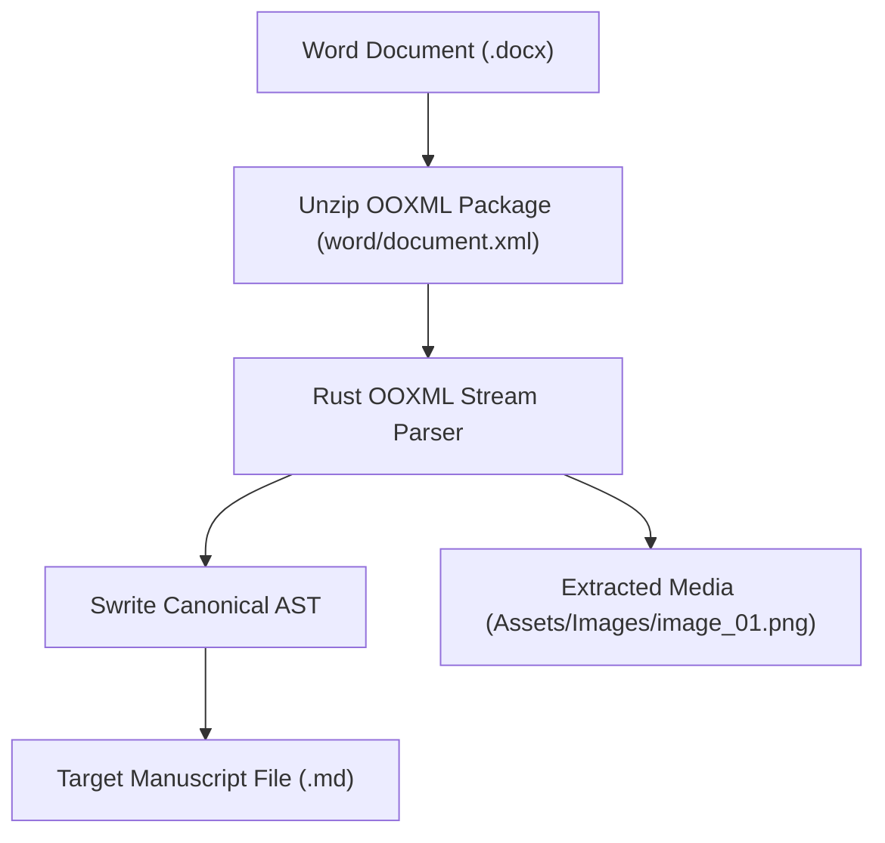

# Swrite 2 — Document Formats Specification

**Document Version:** 1.0.0  
**Status:** Canonical & Locked  
**Milestone:** 1 — Document Model & File System Specification  

---

## 1. Markdown Specification (`.md`)

Swrite 2 implements **CommonMark** with **GitHub Flavored Markdown (GFM)** extensions and custom literary authoring enhancements.

### 1.1 Supported Markdown Syntax Matrix

| Syntax | Markdown Source | AST Node | Rich Editor Rendering |
| :--- | :--- | :--- | :--- |
| **Heading 1** | `# Chapter Title` | `Heading { level: 1 }` | Chapter title styling |
| **Heading 2** | `## Section Title` | `Heading { level: 2 }` | Subheading styling |
| **Heading 3** | `### Scene Title` | `Heading { level: 3 }` | Minor section styling |
| **Paragraph** | `Regular prose text.` | `Paragraph` | Standard indented prose |
| **Emphasis** | `*italic*` or `_italic_` | `Emphasis` | *Italicized text* |
| **Strong** | `**bold**` or `__bold__` | `Strong` | **Bold text** |
| **Strikethrough** | `~~deleted text~~` | `Strikethrough` | ~~Strikethrough text~~ |
| **Blockquote** | `> Epigraph quote` | `Blockquote` | Indented quote with side accent |
| **Scene Break** | `* * *` or `---` or `#` | `SceneBreak` | Centered ornamental divider |
| **Page Break** | `<!-- pagebreak -->` | `PageBreak` | Visual page separator |
| **Unordered List**| `- item` or `* item` | `List { kind: Unordered }` | Bulleted list sequence |
| **Ordered List** | `1. item` | `List { kind: Ordered }` | Numbered sequence |
| **Task List** | `- [ ] todo` / `- [x] done`| `TaskList` | Actionable checklist box |
| **Tables** | `\| A \| B \|` | `Table` | Formatted table grid |
| **Footnotes** | `[^1]` / `[^1]: note` | `FootnoteReference` | Superscript `[1]` badge |
| **Wikilinks** | `[[Character]]` | `Wikilink` | Clickable reference chip |
| **Frontmatter** | `---\ntitle: Ch 1\n---` | `DocumentFrontmatter` | Metadata drawer |

---

### 1.2 Wikilinks Syntax
For cross-referencing characters, locations, chapters, and research across the project:
- Standard: `[[Lucan]]`
- With Display Alias: `[[Lucan|The High Captain]]`
- Cross-Folder Target: `[[Desk/Locations/The Iron Keep|Iron Keep]]`

---

## 2. Plain Text Specification (`.txt`)

Plain text files are guaranteed **100% byte-for-byte lossless storage**:
- **Zero Hidden Markup**: No implicit styling, invisible metadata tags, or automatic Markdown escaping injected into `.txt` files.
- **Line Ending Preservation**: Native line breaks (`\n` LF or `\r\n` CRLF) are detected and preserved on save.
- **Encoding**: Strict **UTF-8** with automatic handling/stripping of optional UTF-8 Byte Order Marks (BOM).

---

## 3. DOCX Import Specification

When importing an external Word `.docx` file into a Swrite project:

### 3.1 Mapping Table: OOXML to Swrite AST

| OOXML Element | Swrite AST Node | Degradation / Safety Policy |
| :--- | :--- | :--- |
| `w:p` with `Heading1` | `Heading { level: 1 }` | Direct semantic map |
| `w:p` with `Heading2` | `Heading { level: 2 }` | Direct semantic map |
| `w:p` (Normal) | `Paragraph` | Direct map, preserves inline runs |
| `w:r` with `w:b` | `Strong` | Preserved |
| `w:r` with `w:i` | `Emphasis` | Preserved |
| `w:r` with `w:strike`| `Strikethrough` | Preserved |
| `w:p` with bullet | `List { kind: Unordered }` | Preserved |
| `w:tbl` | `Table` | Converted to standard Markdown table |
| `w:drawing` / `w:pict`| `Image` | Extracted and written to `Assets/Images/` |
| `w:footnoteReference`| `FootnoteReference` | Mapped to sequential footnote |
| *Macros / VBA Scripts* | *Ignored* | **Stripped safely (security guarantee)** |
| *SmartArt / 3D Models* | *Degraded to static image*| Extracted as static preview if available |

---

## 4. DOCX Export Specification

Swrite 2 produces clean, standard Microsoft Word `.docx` files without relying on external Word installations.

### 4.1 Export Profiles
1. **Standard Manuscript Format (Shunn)**:
   - Font: 12pt Courier New or Times New Roman
   - Spacing: Exactly double-spaced (2.0 line spacing)
   - Margins: 1.0 inch (25.4mm) all sides
   - Running Header: `Author Surname / TITLE / Page #` top-right aligned
   - Scene Breaks: Centered `#` character
2. **Standard Document Format**:
   - Clean modern formatting (11pt Calibri or Georgia, 1.25x line spacing)
   - Proper Word Heading 1 / 2 styles for automatic Navigation Pane generation in Microsoft Word.

---

## 5. File Format Detection & Safety Policy

1. **Magic Byte Verification**:
   - `.docx` files are verified via ZIP header signature (`50 4B 03 04`).
   - Plain text and Markdown files are checked for valid UTF-8 byte sequences.
2. **No Silent Reinterpretation**: If a file named `chapter.txt` contains Markdown formatting, it remains a `.txt` file until the author explicitly converts it. Swrite never alters file extensions or format contracts without user confirmation.
