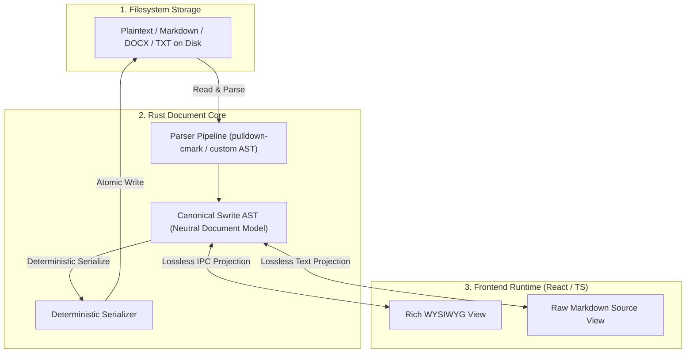

# Swrite 2 — Document Model Specification

**Document Version:** 1.0.0  
**Status:** Canonical & Locked  
**Milestone:** 1 — Document Model & File System Specification  

---

## 1. Core Principles of the Document Model

The Swrite 2 Document Model is a **neutral, tree-structured Abstract Syntax Tree (AST)** designed to represent creative writing, structural narrative elements, editorial annotations, and literary formatting without coupling the core data representation to any single syntax (such as Markdown or HTML) or UI framework (such as ProseMirror or TipTap).



### Key Guarantees:
1. **Semantic Independence**: Formatting reflects structural meaning (Chapter Title, Dialogue Block, Scene Divider, Character Speech) rather than arbitrary CSS pixel sizing.
2. **Deterministic Roundtripping**: Parsing a file into the AST and serializing it back to disk produces byte-equivalent output (modulo standard trailing newline normalization).
3. **Lossless Markdown Fidelity**: Unsupported Markdown extensions or inline HTML tags are captured in specialized `UnknownBlock` or `UnknownInline` nodes and preserved verbatim.
4. **Separation of Concerns**: Prose content lives in AST blocks; editorial commentary lives in metadata anchors; visual styling lives in theme/export profiles.

---

## 2. The Abstract Syntax Tree (AST) Schema

### 2.1 Top-Level Document Structure

```rust
// Canonical Rust AST Definition

pub struct Document {
    /// Unique immutable logical identifier (UUID v4)
    pub id: DocumentId,
    /// Optional frontmatter metadata (title, author, tags, status)
    pub frontmatter: Option<DocumentFrontmatter>,
    /// Root sequence of top-level structural blocks
    pub blocks: Vec<BlockNode>,
    /// Source metadata preserved for lossless formatting roundtrips
    pub source_meta: SourceMeta,
}

pub struct DocumentFrontmatter {
    pub title: Option<String>,
    pub document_type: Option<DocumentType>, // manuscript, outline, note, research
    pub status: Option<DocumentStatus>,     // draft, in_progress, revised, final
    pub custom_fields: HashMap<String, String>,
}

pub struct SourceMeta {
    pub line_ending: LineEnding,            // LF vs CRLF
    pub trailing_newline: bool,
    pub has_bom: bool,
}
```

---

### 2.2 Block Nodes (`BlockNode`)

Blocks are top-level structural elements that cannot be nested within inline runs:

```rust
pub enum BlockNode {
    /// Standard prose paragraph with inline runs
    Paragraph {
        id: BlockId,
        inlines: Vec<InlineNode>,
    },

    /// Structural headings (H1: Chapter/Act, H2: Section, H3: Scene/Subhead)
    Heading {
        id: BlockId,
        level: u8, // 1 to 6
        inlines: Vec<InlineNode>,
    },

    /// Literary blockquotes or dialogue excerpts
    Blockquote {
        id: BlockId,
        blocks: Vec<BlockNode>,
    },

    /// Bulleted or numbered sequence
    List {
        id: BlockId,
        kind: ListKind, // Ordered(start_num) or Unordered(bullet_char)
        items: Vec<ListItem>,
    },

    /// Actionable editorial checklist items
    TaskList {
        id: BlockId,
        items: Vec<TaskItem>,
    },

    /// Narrative scene break (* * * or # or custom ornament)
    SceneBreak {
        id: BlockId,
        ornament: String, // e.g., "* * *"
    },

    /// Hard pagination divider for printed manuscripts
    PageBreak {
        id: BlockId,
    },

    /// Markdown / Standard table structure
    Table {
        id: BlockId,
        headers: Vec<TableCell>,
        rows: Vec<Vec<TableCell>>,
        alignments: Vec<ColumnAlignment>,
    },

    /// Monospaced code block / verse container
    CodeBlock {
        id: BlockId,
        language: Option<String>,
        content: String,
    },

    /// Preserved raw Markdown or HTML that Swrite does not natively render
    UnknownBlock {
        id: BlockId,
        raw_content: String,
        syntax_hint: String,
    },
}
```

---

### 2.3 Inline Nodes (`InlineNode`)

Inlines represent styled text runs, links, spans, and media contained within blocks:

```rust
pub enum InlineNode {
    /// Plain text run
    Text(String),

    /// Strong emphasis (**bold**)
    Strong(Vec<InlineNode>),

    /// Standard emphasis (*italic*)
    Emphasis(Vec<InlineNode>),

    /// Strikethrough (~~deleted~~)
    Strikethrough(Vec<InlineNode>),

    /// Inline code (`const x = 1`)
    Code(String),

    /// Standard hyperlink ([Title](url))
    Link {
        url: String,
        title: Option<String>,
        content: Vec<InlineNode>,
    },

    /// Internal literary Wikilink ([[Lucan]] or [[Chapter 1|Opening]])
    Wikilink {
        target: String,
        alias: Option<String>,
    },

    /// Inline image / figure reference ()
    Image {
        url: String,
        alt: String,
        title: Option<String>,
    },

    /// Numbered footnote reference ([^1])
    FootnoteReference {
        identifier: String,
    },

    /// Preserved inline raw HTML or unsupported inline syntax
    UnknownInline {
        raw_content: String,
    },
}
```

---

## 3. Lossless Markdown Roundtripping Strategy

To fulfill the zero-data-loss contract across **Rich WYSIWYG ⇄ Raw Markdown Source** transitions:

```text
Markdown Text on Disk
       │  (Parsing: AST + Source Annotations)
       ▼
Swrite AST + Raw Spans
       │  (Projection)
       ▼
Rich Editor UI ──[ User Edits Prose ]──▶ Updated AST
       │
       ▼  (Serialization: Exact Style Preservation)
Markdown Text on Disk
```

### Roundtripping Invariants:
1. **List Marker Stability**: If an author wrote `- item`, it is not converted to `* item`. If an author wrote `1. item`, it is not converted to `1) item`.
2. **Whitespace Fidelity**: Single blank lines between paragraphs, standard 2-space line breaks, and trailing EOF newlines are preserved.
3. **Escaped Characters**: Markdown escape sequences (`\*`, `\_`, `\[`) are preserved during source serialization.
4. **Unknown Syntax Encapsulation**: Content like raw `<details>` tags or LaTeX math blocks (`$$...$$`) are encapsulated in `UnknownBlock` nodes and emitted untouched during file saving.

---

## 4. Semantic Formatting vs. Visual Styling

Formatting in Swrite 2 carries **pure semantic meaning**:

| Semantic Block | Logical Purpose | Editor UI Rendering | Publication PDF/DOCX Rendering |
| :--- | :--- | :--- | :--- |
| `Heading 1` | Chapter Opening | 28pt bold serif, theme color | Centered 18pt Garamond, top 2-inch sink, drop folio |
| `Heading 2` | Major Section Break | 20pt semibold serif | Left-aligned 14pt Garamond, italic |
| `Heading 3` | Scene Subheading | 16pt medium serif | Inline bold italic run |
| `Paragraph` | Standard Narrative Prose | Indented 1.5em, 16pt text | Indented 0.25in, justified, 11pt, 1.35x leading |
| `SceneBreak` | Time/POV Transition | Centered `* * *` ornament | Centered 3 asterisks or typographic glyph |
| `Blockquote` | Letter / Lore Excerpt | Left border, 1em indent | Indented 0.5in left/right, 10pt italic |

The document model never stores pixel values, hex colors, or screen-specific dimensions.

---

## 5. Scene & Chapter Representation

Swrite 2 adopts a **lightweight, flexible scene model** that supports both physical and logical file workflows:

### Physical Representation Options:
1. **Multi-File Chapter Directory**:
   - `Manuscript/Chapter 01/01 - Arrival.md`
   - `Manuscript/Chapter 01/02 - The Tavern.md`
   - Each file represents one discrete `Scene` document.
2. **Single Chapter File with Scene Breaks**:
   - `Manuscript/Chapter 01.md` containing `SceneBreak` blocks (`* * *`).
   - The document parser segments the chapter into logical scenes automatically during outliner matrix aggregation.

Both approaches project onto the identical logical hierarchy in Swrite's Plan and Write workspaces without forcing file restructuring.
