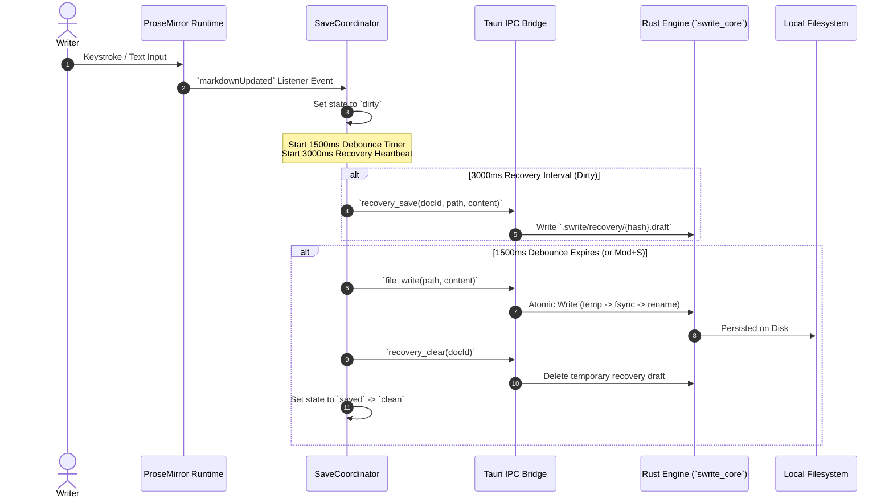

# Swrite 2 — Editor Engine Architecture

## 1. Overview & System Boundary

The Swrite 2 editor engine provides a distraction-free, literary writing canvas powered by **Milkdown** and **ProseMirror**, paired with a dedicated raw Markdown source mode.

The editor architecture enforces a strict unidirectional state hierarchy:

```text
Filesystem (.md / .txt / .docx)
       │
       ▼
Rust Neutral AST (`swrite_core`)
       │
       ▼ (Typed Tauri IPC)
Editor Adapter (`createEditor.ts` / `SaveCoordinator`)
       │
       ▼
ProseMirror State & Transaction Pipeline
       │
       ▼
Manuscript Canvas Surface (`EditorCanvas.tsx`)
```

---

## 2. Core Architectural Principles

1. **Memory State is Ephemeral**:
   The editor runtime never serves as the permanent canonical store. The local filesystem remains the sole source of truth.

2. **Decoupled Keystroke & Persistence Lifecycle**:
   React component state does not re-render the document tree on every keystroke. ProseMirror manages transactional buffer mutations directly in the DOM.

3. **Sub-16ms Frame Latency**:
   All typing operations, decoration updates, and local stats calculations complete in $<2\text{ms}$ on standard hardware, leaving full headroom for 60fps / 120fps display rendering.

4. **Bidirectional Lossless Mode Switching**:
   Authors can toggle instantaneously between WYSIWYG Rich Text and raw Monospace Markdown without losing scroll positions, cursor anchors, or unknown syntax constructs.

---

## 3. Package & Module Structure

```text
src/editor/
├── core/
│   ├── createEditor.ts        # Milkdown / ProseMirror engine factory
│   ├── stats.ts               # Sub-millisecond word & character counter
│   └── types.ts               # Typed editor contracts & callbacks
│
├── schema/
│   ├── nodes.ts               # Custom scene breaks, page breaks, & focus plugin
│   └── anchors.ts             # Comment anchor extraction & resilient locator
│
├── commands/
│   ├── formatting.ts          # Semantic block & mark commands
│   ├── shortcuts.ts           # Studio hotkeys (Mod+S, Mod+Shift+F, Mod+/)
│   └── slashCommands.ts       # Slash command registry & fuzzy matcher
│
├── source/
│   └── SourceEditor.tsx       # Distraction-free raw Markdown source editor
│
├── canvas/
│   ├── EditorCanvas.tsx       # Master canvas orchestrator
│   ├── StatusBar.tsx          # Word counts, read time, & save indicators
│   ├── FormattingBar.tsx      # Subtle contextual formatting toolbar
│   ├── SlashDropdown.tsx      # Fast block insertion popup
│   └── editor.css             # Literary prose typography & calm themes
│
├── sync/
│   └── saveCoordinator.ts    # Debouncing, recovery draft heartbeat, & conflict engine
│
└── index.ts                   # Public clean barrel export
```

---

## 4. Lifecycle & Autosave Coordinator


