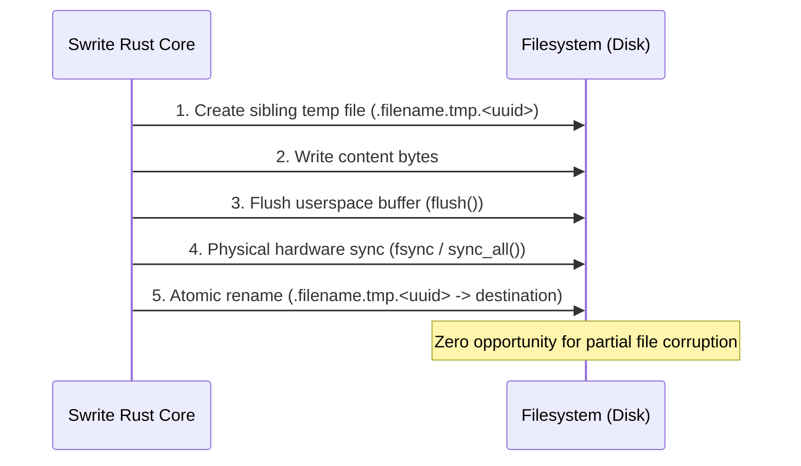

# Swrite 2 — Filesystem Engine Implementation

**Document Version:** 1.0.0  
**Status:** Canonical & Implemented  
**Milestone:** 2 — Rust Document Core & Filesystem Engine  

---

## 1. Filesystem Contract & Project Hierarchy

Swrite 2 enforces the canonical project layout:

```text
Project/
├── Manuscript/          # Author-visible chapter and scene documents
│   ├── Act 1/
│   │   ├── 01 - Scene.md
│   │   └── 02 - Scene.md
│   └── Chapter 02.md
├── Planning/            # Outlines, timelines, character beats
│   ├── Outline.md
│   └── Timeline.md
├── Desk/                # Support notes, worldbuilding, research
│   └── Characters/Lucan.md
├── Assets/              # Media, maps, reference illustrations
└── .swrite/             # Internal metadata sidecars (hidden by backend)
    ├── project.json     # Project manifest & persistent UUID identity map
    ├── history/         # Rolling local snapshots
    ├── recovery/        # In-progress write-ahead recovery drafts
    ├── indexes/         # Derived index caches
    └── cache/
```

---

## 2. Path Security Jail

All filesystem access from the IPC bridge is validated by [`resolve_secure_path`](file:///home/sumeet/Documents/writers-tool/Swrite/src-tauri/src/filesystem/paths.rs#L6-L92):

1. **Rejects Absolute Paths**: Any path starting with `/`, `C:\`, or Windows drive letters is blocked.
2. **Rejects Parent Directory Traversal (`..`)**: Resolving any path component containing `..` fails immediately.
3. **Canonicalization & Symlink Escape Verification**: If the target exists, both `project_root` and the target path are canonicalized (`fs::canonicalize`). The target must start with canonical `project_root`. If it points to an external symlink target, it is blocked with `PathSecurityError::SymlinkEscapeBlocked`.
4. **Backend Hidden File Discipline**: Normal author operations (`read`, `write`, `create`, `delete`) set `allow_internal = false`. Any path containing `.swrite`, `.git`, or hidden dotfiles is rejected by the backend itself, preventing frontend leakage.

---

## 3. Atomic Write-Temp-Sync-Rename Protocol

To eliminate 0-byte file truncations during power outages, system crashes, or disk-full events, [`atomic_write_bytes`](file:///home/sumeet/Documents/writers-tool/Swrite/src-tauri/src/filesystem/atomic_write.rs#L8-L79) executes the following sequence:



If any step fails, the temporary file is deleted, and the original destination file remains completely untouched.

---

## 4. Content Hashing & Dirty Identity

- **SHA-256 Digest** ([`sha256_digest`](file:///home/sumeet/Documents/writers-tool/Swrite/src-tauri/src/filesystem/hashing.rs#L5-L10)): Hex-encoded cryptographic SHA-256 hash used for snapshot integrity, recovery matching, and three-way reconciliation.
- **Fast 64-bit FNV-1a Hash** ([`fast_content_hash`](file:///home/sumeet/Documents/writers-tool/Swrite/src-tauri/src/filesystem/hashing.rs#L14-L24)): Ultra-fast in-memory hash used for rapid keystroke dirty detection.

---

## 5. Project Discovery & Self-Healing

[`discover_project_files`](file:///home/sumeet/Documents/writers-tool/Swrite/src-tauri/src/project/discovery.rs#L24-L95) recursively traverses the project with deterministic sorting. It filters out internal `.swrite/`, `.git/`, and `.tmp` directories at the traversal level.

[`validate_and_heal_project`](file:///home/sumeet/Documents/writers-tool/Swrite/src-tauri/src/project/validation.rs#L16-L106) automatically reconstructs missing standard folders or a corrupted `.swrite/project.json` without failing, ensuring portable resilience if a project directory is zipped or moved across machines.
