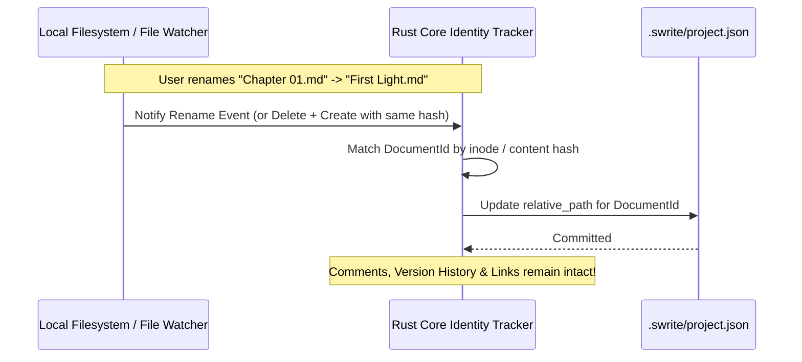

# Swrite 2 — Filesystem Model & Project Specification

**Document Version:** 1.0.0  
**Status:** Canonical & Locked  
**Milestone:** 1 — Document Model & File System Specification  

---

## 1. Project Directory Layout

A Swrite 2 project is a **sovereign, human-readable directory** on the local filesystem.

```text
My Novel Project/
├── Manuscript/
│   ├── Act 1/
│   │   ├── 01 - The Opening Gate.md
│   │   └── 02 - Whispers in the Fog.md
│   └── Act 2/
│       └── 01 - The Sunken Tower.md
├── Planning/
│   ├── Outline.md
│   ├── Timeline.md
│   └── Character Sketches.md
├── Desk/
│   ├── Moodboards/
│   │   └── The Capital.json
│   ├── Characters/
│   │   └── Lucan.md
│   └── Research/
│       └── Medieval Siegecraft.md
├── Assets/
│   ├── Images/
│   │   └── capital_city_sketch.png
│   └── Maps/
│       └── northern_isles.jpg
└── .swrite/
    ├── project.json
    ├── history/
    ├── indexes/
    └── recovery/
```

---

## 2. Directory Responsibilities

| Directory | Purpose | File Formats Supported | Visible to Author? |
| :--- | :--- | :--- | :--- |
| **`Manuscript/`** | Canonical author prose (Acts, Chapters, Scenes) | `.md`, `.txt`, `.docx` | **Yes (Primary)** |
| **`Planning/`** | Outlines, beat sheets, timelines, synopses | `.md`, `.txt` | **Yes** |
| **`Desk/`** | Moodboards, character lore, world research | `.md`, `.txt`, `.json` | **Yes** |
| **`Assets/`** | Reference images, attachments, cartography | `.png`, `.jpg`, `.webp`, `.svg` | **Yes** |
| **`.swrite/`** | Internal project metadata, snapshots, index | `.json`, `.bin` | **No (Strictly Hidden)** |

---

## 3. Stable Document Identity Model

### The Problem:
If an author renames `Chapter 01.md` to `The Beginning.md` or moves it into an `Act 1/` subfolder, file-path-only systems lose track of version history, comments, and project links.

### The Swrite 2 Solution:
Swrite decouples **logical identity** from **physical filepath** using a persistent UUID mapping recorded in `.swrite/project.json`:

```rust
pub struct DocumentIdentity {
    pub id: DocumentId,              // e.g., "doc_a1b2c3d4-..."
    pub relative_path: PathBuf,      // e.g., "Manuscript/Act 1/01 - The Opening Gate.md"
    pub content_hash: String,        // xxHash64 / BLAKE3 of current file
    pub created_at: u64,
    pub last_modified: u64,
}
```



---

## 4. Internal `.swrite/` Directory Specification

The `.swrite/` directory contains only ephemeral or supporting application metadata. **The complete manuscript is never duplicated inside `project.json`.**

### Structure:
- **`project.json`**: Manifest containing project UUID, title, schema version, open tabs, and document identity maps.
- **`history/`**: Rolling delta snapshots of saved document milestones for visual version comparison.
- **`indexes/`**: Ephemeral, fast-rebuild search and wikilink token indexes.
- **`recovery/`**: Temporary write-ahead recovery buffers for crash resilience.

```json
{
  "schemaVersion": 1,
  "projectId": "proj_8f1a2b3c-4d5e-6f7a-8b9c-0d1e2f3a4b5c",
  "name": "The Starlit Citadel",
  "author": "A. Vance",
  "createdAt": 1775390400,
  "updatedAt": 1775394000,
  "defaultManuscriptDir": "Manuscript",
  "activeDocumentId": "doc_e4f5a6b7-8c9d-0e1f-2a3b-4c5d6e7f8a9b",
  "documentMap": {
    "doc_e4f5a6b7-8c9d-0e1f-2a3b-4c5d6e7f8a9b": {
      "path": "Manuscript/Act 1/01 - The Opening Gate.md",
      "hash": "a4f83c12d9e0b1f2"
    }
  },
  "viewState": {
    "activeEnvironment": "write",
    "themeId": "midnight",
    "typographyId": "merriweather-classic"
  }
}
```

---

## 5. Hidden File Policy & Filtering Rules

Swrite 2 enforces strict dotfile encapsulation:
1. **Default Rule**: Any file or folder beginning with `.` (e.g. `.swrite`, `.git`, `.DS_Store`, `.cache`, `.history`, `.tmp`) is **filtered out** from the user's visible file manager tree.
2. **Exemption**: Only an explicit developer/debug toggle in Preferences can expose dotfiles.
3. **Pristine Author Experience**: The sidebar displays only pure literary chapters, scenes, planning documents, and desk notes.

---

## 6. Cross-Platform Filename Safety

To ensure 100% portability across Linux (ext4), macOS (APFS), and Windows (NTFS):

1. **Restricted Character Sanitization**: Disallowed filename characters (`/`, `\`, `:`, `*`, `?`, `"`, `<`, `>`, `|`, `\0`) are rejected or converted to clean dashes on rename/create.
2. **Reserved Names Protection**: Names like `CON`, `PRN`, `AUX`, `NUL`, `COM1`–`COM9`, `LPT1`–`LPT9` on Windows are intercepted and prevented.
3. **Unicode Normalization**: All filenames and document paths are normalized using **Unicode NFC** format.
4. **Case Preservation & Collision Check**: On case-insensitive filesystems (Windows/macOS), creating `scene.md` when `Scene.md` already exists triggers an explicit rename prompt rather than overwriting.

---

## 7. Project Opening Lifecycle & Portability

```text
Step 1: User selects folder "My Novel Project"
           │
Step 2: Rust Core validates directory permissions & existence
           │
Step 3: Read or initialize `.swrite/project.json`
           │
Step 4: Scan `Manuscript/`, `Planning/`, `Desk/`, `Assets/`
           │
Step 5: Reconcile missing/new files against DocumentMap
           │
Step 6: Emit Project Tree to UI in < 30ms (zero full-manuscript memory bloat)
```

### Portability Guarantee:
A user can compress their project folder, copy it via USB or cloud drive to another machine running Linux, macOS, or Windows, and open it in Swrite 2 with zero configuration loss.
