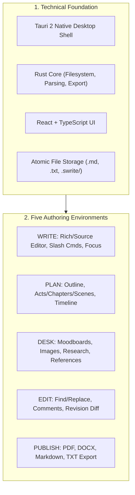

# Swrite 2 — MVP Scope & Functional Boundary

**Document Version:** 1.0.0  
**Status:** Canonical & Locked  
**Milestone:** 0 — Product Contract  

---

## 1. Scope Governance

This document defines the strict, locked scope for the initial release of **Swrite 2**. 

Features not explicitly listed in the **In-Scope** section are prohibited during MVP construction. Speculative features, experimental modules, and external integrations will not be added to foundational milestones.

---

## 2. In-Scope MVP Systems

---

### 2.1 Technical Foundation
- **Platform**: Tauri 2 desktop shell running on Linux, macOS, and Windows.
- **Backend**: High-performance Rust Core owning filesystem I/O, file watchers, document serialization/deserialization, search indexing, and export compilation.
- **Frontend**: Responsive, modern React 18+ with TypeScript, Tailwind CSS, and polished typography.
- **Storage Layer**: Local filesystem-first architecture with atomic disk writes, crash-safe autosave, and internal metadata in `.swrite/`.

---

### 2.2 Environment 1: WRITE
- **Dual-Mode Authoring**: Seamless toggle between Rich WYSIWYG and Raw Markdown Source mode with zero content drift.
- **Document Support**:
  - Full GitHub-Flavored Markdown (`.md`) with tables, footnotes, and blockquotes.
  - Lossless Plain Text (`.txt`).
  - Standard `.docx` importing and exporting.
- **Slash Commands (`/`)**: Fast in-line commands for headings, blockquotes, scene breaks, bullet/numbered lists, tables, and notes.
- **Distraction-Free Focus Mode**: Full-screen minimalism with toggleable Typewriter centered scrolling.
- **Scene Context**: Lightweight scene goal/synopsis bar accessible above the prose canvas.

---

### 2.3 Environment 2: PLAN
- **Structural Hierarchy**: Acts, Chapters, and Scenes organized in a tree or flat pantser structure.
- **Outline Matrix**: Multi-column structural view displaying title, status, synopsis, and target word counts.
- **Basic Timeline**: Chronological sequence of story beats and narrative milestones without complex state engines.
- **Planning Notes**: Freeform planning documents linked to chapters or acts.

---

### 2.4 Environment 3: DESK
- **Visual Moodboards**: Tactile canvas for arranging reference images, character portraits, landscape maps, and color swatches.
- **Creative Notes**: Markdown/TXT notes for world lore, dialogue snippets, research quotes, and brainstorming.
- **Asset Manager**: Local storage and caching of user-added images and references in the project's `Assets/` directory.

---

### 2.5 Environment 4: EDIT
- **Find & Replace**: Fast, case-sensitive and regex-capable project-wide search and replace.
- **Threaded Comments**: Anchored text highlights with collapsible margin comment threads, reply chains, and resolve toggles.
- **Revision Passes**: Structured checklist for tracking line edits, sensory adjustments, and plot continuity notes.
- **Version History & Diffs**: Side-by-side visual diff comparison between current text and saved snapshots with instant rollback.

---

### 2.6 Environment 5: PUBLISH
- **Print PDF**: Typeset book layouts (6×9 trade paperback, 5.5×8.5 digest, Letter, A5) with running headers, page numbers, and custom margins.
- **Submission DOCX**: Industry-standard Shunn submission format (courier/times, double spaced, 1" margins).
- **Clean Markdown & TXT**: Bundled manuscript compilation into a single clean file.
- **Front & Back Matter**: Optional inclusion of Title Page, Copyright page, Dedication, Epigraph, Table of Contents, and About the Author bio.

---

## 3. Explicitly Out-of-Scope (Prohibited for MVP)

The following capabilities are deliberately excluded from Swrite 2 MVP:

| Excluded Domain | Justification & Rationale |
| :--- | :--- |
| **Artificial Intelligence (AI)** | Swrite is human stationery; no LLM generation, chat, or automated rewriting. |
| **Cloud Synchronization** | Offline-first local reliability comes first; no servers or sync protocols in MVP. |
| **Accounts & Auth** | Personal local software requires no login, email, password, or subscription. |
| **World Simulation Engine** | Dynamic state simulation engines and rule runners add excessive complexity. |
| **Giant Relational Databases** | Writing software should not force writers to fill out 40-field database entities. |
| **Social & Collaboration** | No multi-user live cursors, public links, follower feeds, or shared workspaces. |
| **Plugin Marketplace** | Plugin architecture boundaries will be specified, but no runtime distribution. |
| **Gamified Analytics** | No distraction-causing streak counters, xp bars, or intrusive writing alarms. |

---

## 4. MVP Acceptance Criteria & Quality Gates

The Swrite 2 MVP will be deemed complete only when all the following criteria are met:

1. **Typing Responsiveness**: Input latency under 16ms (60 fps) even in manuscripts exceeding 150,000 words.
2. **Lossless Markdown Roundtripping**: Switching between Rich WYSIWYG and Source Markdown 1,000 times produces 0 byte drift.
3. **Crash Resilience**: Sudden application termination or power loss loses at most the last 2 seconds of uncommitted keystrokes.
4. **Filesystem Inspectability**: Opening the project folder in VS Code, Obsidian, or Finder shows pure, readable Markdown and assets.
5. **Clean Verification**: Zero console warnings, 100% type-safe compilation, and complete automated test pass.
