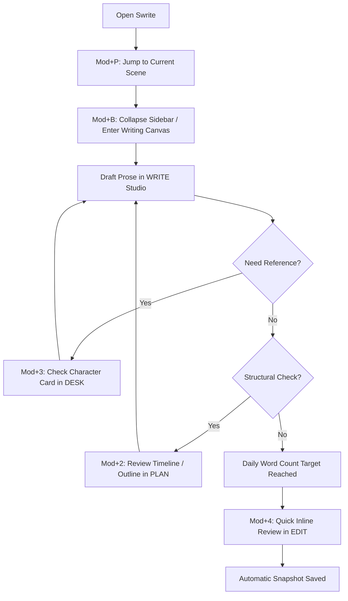

# SWRITE 2 — Personal Writing Workflow

A deep dive into the long-form writing workflow tested and refined during dogfooding on *The Chronomancer Saga / The Obsidian Citadel* (50+ chapters, 200+ scenes).

---

## 1. Project Organization Standard

For optimal friction-free operation, long-form novels and projects are organized with clean filesystem semantics:

```text
MyNovel/
├── .swrite/
│   ├── project.json          # Project metadata, studio configurations
│   ├── planning.json         # Outline nodes, scene status, timeline events
│   ├── desk/                 # Research notes, moodboards, character cards
│   ├── history/              # Local snapshots and version checkpoints
│   └── plugins/              # Trusted local plugins
├── 01_Act_I/
│   ├── 01_Chapter_1.md
│   ├── 02_Chapter_2.md
│   └── 03_Chapter_3.md
├── 02_Act_II/
│   ├── 04_Chapter_4.md
│   └── ...
└── 03_Act_III/
    └── ...
```

---

## 2. The Daily Writing Loop



### Stage 1: Fast Launch & Focus
1. Launch Swrite — opens immediately into the last active document.
2. Press `Mod + B` to hide the file tree, leaving a clean, centered typography canvas.
3. Word count and session delta track progress dynamically in the quiet status bar.

### Stage 2: In-Flow Context Switching
- While writing a confrontation scene, the author needs to verify the antagonist's eye color or magic constraints.
- Press `Mod + 3` (Desk): Review the character profile and research notes.
- Press `Mod + 1` (Write): Return immediately to the exact cursor position in the manuscript.

### Stage 3: Daily Milestones & Version Checkpoints
- At the end of the session, Swrite has continuously saved all changes atomically.
- Press `Mod + 4` (Edit): Create an explicit milestone checkpoint (e.g., `"End of Day 14 Draft - Chapter 12 Complete"`).
- Review inline revision notes for tomorrow's warm-up session.

---

## 3. Keyboard-Driven Efficiency

Authors never need to lift their hands from the keyboard for common actions:

- **Navigation:**
  - `Mod + 1..5` — Studio switcher
  - `Mod + P` — Fuzzy file / document search
  - `Mod + [` / `Mod + ]` — Navigate previous / next scene in manuscript order
  - `Mod + B` — Toggle sidebar
- **Formatting:**
  - `Mod + B` (on selection) — Bold
  - `Mod + I` (on selection) — Italic
  - `/` — Slash command menu for quick block insertion
- **Search & Execution:**
  - `Mod + F` — Search within active file
  - `Mod + Shift + F` — Global project search
  - `Mod + K` — Command Palette

---

## 4. Multi-Device & Backup Safety

Because Swrite projects are plain filesystem directories with standard Markdown files:
- Projects can be synced using standard file sync tools (Dropbox, Google Drive, Syncthing, Git).
- If external tools modify a file, Swrite detects the change via file-watching and reconciles it cleanly without overwriting unsaved work.
- In the event of a system power failure, atomic temporary writes guarantee zero file corruption, and recovery drafts are preserved in `.swrite/recovery/`.
