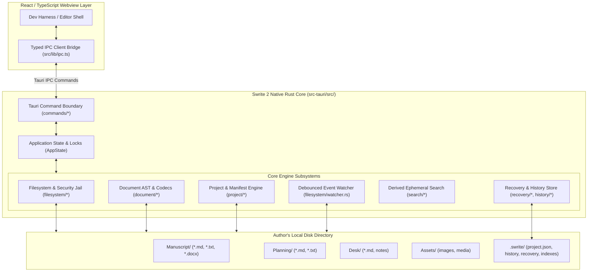

# Swrite 2 — Rust Core Architecture

**Document Version:** 1.0.0  
**Status:** Canonical & Implemented  
**Milestone:** 2 — Rust Document Core & Filesystem Engine  

---

## 1. System Architecture Overview

The Swrite 2 native engine is implemented in Rust using Tauri 2. The core design strictly enforces a **filesystem-first contract** where the author's local directory is the authoritative source of truth.

---

## 2. Module Boundaries & Responsibilities

| Module Path | Responsibility | Key Structs & Functions |
| :--- | :--- | :--- |
| [`src-tauri/src/error.rs`](file:///home/sumeet/Documents/writers-tool/Swrite/src-tauri/src/error.rs) | Typed, serializable error hierarchy (`SwriteError`, `IpcError`). | `ProjectError`, `FilesystemError`, `PathSecurityError`, `DocumentParseError`, `DocumentSerializeError`, `FormatError`, `RecoveryError`, `WatcherError`, `ReconciliationError`, `ValidationError` |
| [`src-tauri/src/filesystem/`](file:///home/sumeet/Documents/writers-tool/Swrite/src-tauri/src/filesystem/) | Atomic writes, path jail resolution, content hashing, and file watching. | `resolve_secure_path`, `atomic_write_bytes`, `sha256_digest`, `fast_content_hash`, `ProjectWatcher`, `reconcile_content` |
| [`src-tauri/src/document/`](file:///home/sumeet/Documents/writers-tool/Swrite/src-tauri/src/document/) | Neutral AST, Markdown CommonMark/GFM/Wikilinks parser/serializer, TXT codec, OpenXML DOCX codec, format sniffer. | `Document`, `BlockNode`, `InlineNode`, `parse_markdown`, `serialize_markdown`, `parse_txt`, `serialize_txt`, `import_docx`, `export_docx`, `sniff_format` |
| [`src-tauri/src/project/`](file:///home/sumeet/Documents/writers-tool/Swrite/src-tauri/src/project/) | Project lifecycle, manifest validation, persistent UUID document identities, recursive file discovery. | `ProjectManifest`, `IdentityManager`, `discover_project_files`, `validate_and_heal_project`, `create_project`, `open_project` |
| [`src-tauri/src/recovery/`](file:///home/sumeet/Documents/writers-tool/Swrite/src-tauri/src/recovery/) | 3-second write-ahead recovery drafts and local rolling history snapshots. | `save_recovery_draft`, `clear_recovery_draft`, `list_recovery_drafts`, `create_snapshot`, `list_snapshots`, `get_snapshot` |
| [`src-tauri/src/history/`](file:///home/sumeet/Documents/writers-tool/Swrite/src-tauri/src/history/) | History store management. | `HistoryStore` |
| [`src-tauri/src/search/`](file:///home/sumeet/Documents/writers-tool/Swrite/src-tauri/src/search/) | Fast in-memory ephemeral full-text search index. | `EphemeralSearchIndex::rebuild_from_disk`, `search` |
| [`src-tauri/src/commands/`](file:///home/sumeet/Documents/writers-tool/Swrite/src-tauri/src/commands/) | Typed Tauri IPC commands. | `project_*`, `file_*`, `document_*`, `recovery_*`, `history_*`, `search_*`, `watch_*`, `reconciliation_*` |
| [`src-tauri/src/state.rs`](file:///home/sumeet/Documents/writers-tool/Swrite/src-tauri/src/state.rs) | Thread-safe in-memory state using `parking_lot::RwLock`. | `AppState` |

---

## 3. Dependency Choices & Auditing

| Crate | Version | License | Justification |
| :--- | :--- | :--- | :--- |
| `tauri` | `2.2.4` | Apache-2.0 / MIT | Modern lightweight cross-platform desktop shell. |
| `pulldown-cmark` | `0.12` | MIT | High-performance SIMD CommonMark + GFM parser. |
| `quick-xml` | `0.37` | MIT | Zero-copy fast OpenXML DOCX streaming parser and generator. |
| `zip` | `2.2` | MIT | Pure Rust ZIP archive reader/writer for `.docx` containers. |
| `notify` | `7.0` | CC0-1.0 | Cross-platform filesystem watcher (`inotify`, `FSEvents`, `ReadDirectoryChangesW`). |
| `sha2` | `0.10` | MIT / Apache-2.0 | Cryptographic SHA-256 content hashing for snapshot & dirty identity. |
| `uuid` | `1.11` | Apache-2.0 / MIT | RFC 9562 UUID v4 persistent document identity generation. |
| `chrono` | `0.4` | MIT / Apache-2.0 | ISO 8601 UTC timestamping for snapshots and manifest. |
| `parking_lot` | `0.12` | Apache-2.0 / MIT | High-concurrency spin/futex `RwLock` and `Mutex`. |
| `walkdir` | `2.5` | Unlicense / MIT | Deterministic recursive project file tree traversal. |
| `thiserror` | `2.0` | MIT / Apache-2.0 | Ergonomic typed Rust error derivation. |

---

## 4. Tauri Command Boundary & IPC Security

Direct absolute path access is completely disabled. All file and document operations accept **relative paths** that are checked against `resolve_secure_path(project_root, relative_path, allow_internal)`.
If a path contains `../`, absolute roots, or symlinks pointing outside the project root, it is immediately rejected with `PathSecurityError::PathTraversalBlocked` or `SymlinkEscapeBlocked`.
