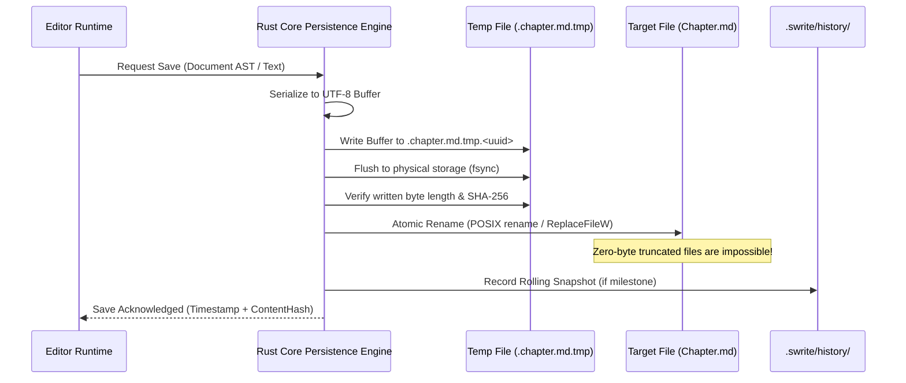

# Swrite 2 — Storage, Persistence & Crash Recovery Specification

**Document Version:** 1.0.0  
**Status:** Canonical & Locked  
**Milestone:** 1 — Document Model & File System Specification  

---

## 1. Atomic Persistence Protocol

Writing manuscripts to disk must be **safe by design**. Direct in-place writes to active files risk truncation or corruption if the system crashes or loses power mid-write.



### Protocol Steps:
1. **Serialization**: Convert in-memory Document AST into deterministic UTF-8 bytes.
2. **Temporary Sibling Write**: Write bytes to a hidden sibling file in the same directory (`.target.md.tmp.[uuid]`). Creating the temp file on the same filesystem volume guarantees that the subsequent rename is an atomic pointer swap.
3. **Hardware Flush (`fsync`)**: Force write buffers through OS kernel caches down to physical storage.
4. **Integrity Validation**: Verify the written file size and checksum match the buffer.
5. **Atomic Replace**: Execute atomic rename (`std::fs::rename` on Unix, `SetFileInformationByHandle` / `ReplaceFileW` on Windows) over the destination file.
6. **Cleanup**: Remove any stale temporary artifacts.

---

## 2. Crash Recovery Architecture

In the event of sudden operating system shutdown, battery failure, or process termination:

```text
.swrite/recovery/
├── doc_a1b2c3d4.recovery.json   (Buffered edits with timestamp)
└── session_lock.json            (Active process heartbeat PID)
```

### 2.1 Write-Ahead Recovery Buffer
- When the editor contains dirty uncommitted changes, an incremental delta buffer is flushed to `.swrite/recovery/` every 3 seconds.
- On standard successful save, the corresponding recovery artifact is instantly cleared.

### 2.2 Startup Recovery Reconciliation
When a project opens, Swrite scans `.swrite/recovery/`:
1. If recovery files exist with timestamps **newer** than the corresponding files on disk:
   - Swrite displays a calm **Recovery Assistant** banner.
   - The author can view a side-by-side diff between the disk version and recovered buffer.
   - The author chooses: `[ Restore Recovered Text ]` or `[ Discard Recovery Buffer ]`.

---

## 3. Version History & Snapshot Management

```text
.swrite/history/
├── doc_a1b2c3d4/
│   ├── 20261005_120000_manual_pre_revision.snap
│   ├── 20261005_134500_auto_chapter_complete.snap
│   └── index.json
```

- **Snapshots are Immutable**: Each snapshot contains full text or zstd-compressed reverse deltas with timestamp, word count, and optional author label.
- **Visual Diff Engine**: The **EDIT** environment compares any two snapshots, computing added (green underline) and removed (red strike) paragraphs down to individual word tokens.
- **One-Click Reversion**: Restoring an older version creates an automatic safety snapshot of the current state before replacing the file.

---

## 4. External File Modification & Watcher Protocol

Swrite 2 coexists harmoniously with external tools (VS Code, Obsidian, Git, Word). The Rust core maintains a non-blocking filesystem watcher using the native `notify` crate.

```mermaid
flowchart TD
    Watcher["Rust Filesystem Watcher (notify)"] -->|File Modified on Disk| Detect["Detect File Change Event"]
    Detect --> CheckDirty{"Is Document Dirty in Swrite?"}

    CheckDirty -->|No (Clean Editor)| AutoReload["Silently & Smoothly Reload Document in UI"]
    CheckDirty -->|Yes (Unsaved Edits in Swrite)| Prompt["Present 3-Way Reconciliation Modal"]

    Prompt --> Opt1["Keep Swrite Version (Overwrite Disk)"]
    Prompt --> Opt2["Accept Disk Version (Discard Swrite Edits)"]
    Prompt --> Opt3["Save Both (Create Conflicted Copy)"]
```

### Guarantees:
- **Zero Silent Overwrites**: Swrite will never silently overwrite modifications made by external editors if the author has typed local changes.
- **Zero External File Lock**: Swrite releases file handles immediately after reading/writing, allowing external tools to edit files without permission errors.

---

## 5. Derived & Ephemeral Search Index

- **Location**: Stored in `.swrite/indexes/search.idx`.
- **Ephemeral Rule**: The search index is purely derived from source files on disk.
- **Self-Healing Guarantee**: If `.swrite/indexes/` is deleted, corrupted, or incompatible across versions, Swrite silently regenerates the index from the `Manuscript/`, `Planning/`, and `Desk/` Markdown files in background threads with zero impact on manuscript integrity.
