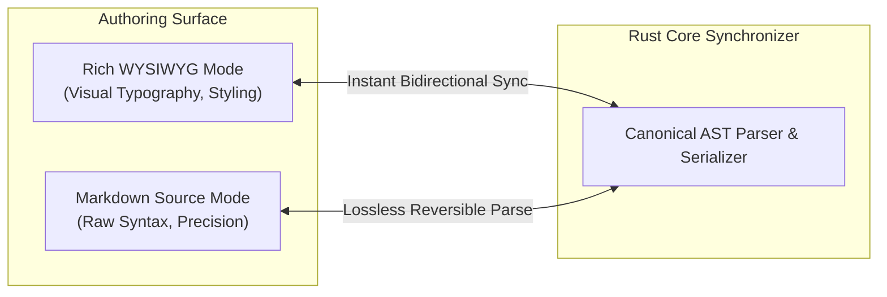

# Swrite 2 — UX Principles & Interaction Architecture

**Document Version:** 1.0.0  
**Status:** Canonical & Locked  
**Milestone:** 0 — Product Contract  

---

## 1. Core UX Principles

Swrite 2 is designed according to six fundamental human-interface principles:

### 1.1 Manuscript First
The prose on the page is visually dominant across all standard writing states. Margins, line height, contrast, and font rendering replicate the quiet dignity of high-grade paper and bespoke book typography. The manuscript is never squeezed into an awkward leftover pane.

### 1.2 One Primary Task
Each workspace has a single, unambiguous purpose. When drafting, the goal is writing words. When planning, the goal is structuring beats. When on the desk, the goal is gathering creative references. When editing, the goal is polishing prose. When publishing, the goal is typesetting the final book. Swrite avoids "split-brain" dashboards that try to do everything at once.

### 1.3 Contextual Secondary UI
Secondary metadata, inspectors, and status summaries appear only when relevant to the author's immediate selection or explicit intent. During active typing, peripheral panels fade or remain discreetly tucked away.

### 1.4 Capabilities on Demand
Advanced tooling remains invisible until summoned via:
- Contextual selection menus
- Fast keyboard shortcuts
- The unified command palette (`Cmd/Ctrl + K`)
- In-prose slash commands (`/`)

### 1.5 Calm Visual Language
Swrite rejects modern software fads in favor of classic, enduring digital stationery.
- **Strictly Prohibited**: Glassmorphism, aggressive gradients, glowing neon borders, excessive card rounding, decorative bounce animations, visual clutter.
- **Embraced**: Refined serif and monospace typography, generous purposeful whitespace, crisp hairline borders, subtle muted accents, and high-legibility contrast.

### 1.6 Zero Cognitive Tax
Every single button, badge, icon, and line of text on screen must actively justify its presence. If an element does not directly aid the writer in drafting, planning, or editing, it is removed.

---

## 2. Navigation Architecture

Swrite 2 provides five top-level environments representing writer modes:

```text
[ WRITE ]   [ PLAN ]   [ DESK ]   [ EDIT ]   [ PUBLISH ]
```

### Strict Navigation Rules:
1. **No Fragmented Top-Level Tabs**: Secondary tools (such as Timeline, Characters, Lore Notes, Moodboards, Revision Queues, Comments) are contained *within* their parent environment rather than occupying permanent real estate on the top header.
2. **Instant Hotkey Switching**: Dedicated global shortcuts allow switching between primary environments in milliseconds without touching the mouse (`Cmd/Ctrl + 1..5`).
3. **Workspace Memory**: Returning to an environment immediately restores the exact scroll position, active scene, and contextual focus where the author left off.

---

## 3. The Dual-Model Editor Experience



### 3.1 Rich Editing vs. Source Editing
- **Rich Mode**: Provides a tactile, formatted writing canvas with instant visual hierarchy, italics, bolding, blockquotes, scene breaks, and inline dialogue styling.
- **Source Mode**: Provides a raw, high-speed Markdown editing experience with monospaced precision and syntax highlighting.
- **Zero Content Drift**: Switching between Rich and Source modes is 100% lossless. Formatting marks, blank lines, and structure are preserved with exact fidelity.

### 3.2 Slash Commands (`/`)
Typing `/` on an empty line or after a space opens a lightweight, keyboard-navigable command palette:

| Command | Action | Output / Behavior |
| :--- | :--- | :--- |
| `/h1`, `/h2`, `/h3` | Heading Levels | Formats block as Chapter, Section, or Subsection header |
| `/scene` | Scene Break | Inserts an ornamented scene break (`* * *` or `#`) |
| `/quote` | Blockquote | Formats text as an indented dialogue or literary excerpt |
| `/bullet`, `/num` | Lists | Initiates bulleted or numbered sequence |
| `/check` | Task Item | Creates an actionable revision checklist item |
| `/note` | Margin Note | Attaches a side note to current block |
| `/comment` | Comment | Opens threaded review comment on current selection |
| `/table` | Table | Inserts clean Markdown table structure |
| `/page` | Page Break | Inserts hard pagination divider for book layout |

---

## 4. Comments vs. Notes Distinction

Swrite strictly distinguishes between **Editorial Comments** and **Author Notes**:

```text
┌──────────────────────────────────────┐  ┌──────────────────────────────────────┐
│          EDITORIAL COMMENTS          │  │             AUTHOR NOTES             │
├──────────────────────────────────────┤  ├──────────────────────────────────────┤
│ • Anchored to specific text/ranges   │  │ • Independent thought artifacts      │
│ • Targeted for revision and critique │  │ • Planning, ideas, research, lore    │
│ • State: Open ⇄ Resolved ⇄ Deleted   │  │ • State: Living reference documents  │
│ • Hidden when resolved               │  │ • Belong to project, chapter, desk   │
│ • Strippable on publication export   │  │ • Always accessible from workspace   │
└──────────────────────────────────────┘  └──────────────────────────────────────┘
```

---

## 5. File Management & Hidden-File Discipline

### 5.1 The Clean Project Browser
The sidebar file manager behaves as a **clean literary binder**, not a raw OS directory dump:
- Organized by user-defined folders, chapters, scenes, and notes.
- Drag-and-drop reordering that immediately updates the narrative sequence.
- Filter by status tags (`Draft`, `In Progress`, `Revised`, `Final`) or search query.

### 5.2 Hidden Dotfile Protection
System dotfiles, internal caches, and git directories (`.swrite/`, `.git/`, `.history/`, `.cache/`) are **strictly hidden** in standard author views. The user's creative space remains pristine.

---

## 6. Creative Desk & Visual Moodboards

The **DESK** environment is an unconstrained visual and textual sanctuary:
- **Card & Canvas Layout**: Pin images, character portraits, historical maps, and reference clippings.
- **Captions & Color Swatches**: Attach short narrative cues, color palettes, and thematic keywords to visual items.
- **Restrained Interaction**: Designed for atmosphere and tactile reference rather than full-blown graphic design software complexity.

---

## 7. Decoupled Theme & Publishing Typography

```text
   ┌───────────────────────────┐         ┌───────────────────────────┐
   │    EDITOR VISUAL THEME    │         │    PUBLICATION ENGINE     │
   ├───────────────────────────┤         ├───────────────────────────┤
   │ • Midnight Dark / Sepia   │         │ • Industry 6×9 Paperback  │
   │ • High-contrast writing   │   ≠     │ • Pure White Garamond     │
   │ • Writer eye comfort      │         │ • Strict Print Margins    │
   │ • Screen-only rendering   │         │ • Standard DOCX / PDF     │
   └───────────────────────────┘         └───────────────────────────┘
```

- Writing in Dark Mode never causes a compiled PDF or DOCX to have dark pages.
- The publication engine is completely isolated from author UI preferences.
