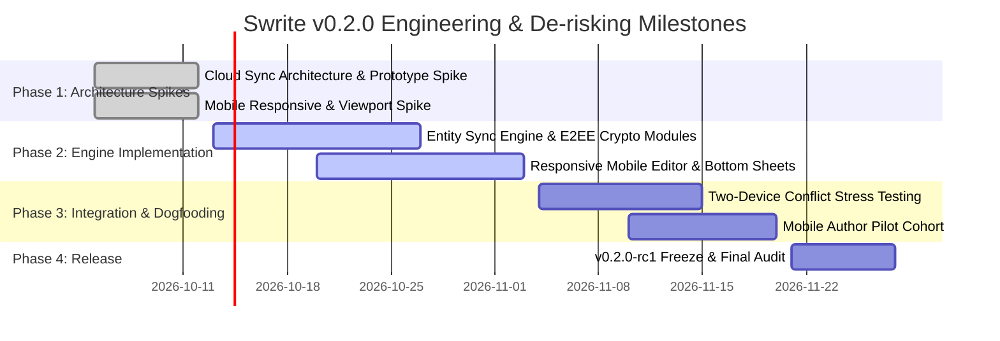

# Swrite — v0.2.0 Strategic Roadmap & Architectural Blueprint

**Baseline:** `v0.1.0` (Stable)  
**Target Release:** `v0.2.0`  
**Guiding Principle:** *Local-first remains the default. Cloud sync and mobile drafting are optional, zero-compromise enhancements.*

---

## 1. Executive Strategy

Following the successful release of Swrite `v0.1.0`, the `v0.2.0` development cycle is strictly constrained to **two strategic pillars**:

$$\boxed{\textbf{Pillar A: Optional Encrypted Cloud Sync}} \qquad\text{and}\qquad \boxed{\textbf{Pillar B: Responsive Mobile Drafting}}$$

All other feature requests (e.g. World Simulation expansion, complex multi-user collaboration wikis, AI co-writers) remain deferred to protect product focus, stability, and speed.

---

## 2. Strategic Pillars & Scope

### Pillar A: Optional Encrypted Cloud Sync
- **Objective:** Enable independent authors to seamlessly move between desktop and laptop without manual JSON/Markdown export and without surrendering privacy.
- **Non-Negotiable Constraints:**
  - Zero mandatory account creation (local-only mode is forever first-class).
  - Client-side end-to-end encryption (E2EE): Server stores only ciphertext blobs and blind entity hashes.
  - Zero naive full-file overwrites: Granular entity synchronization (Acts, Chapters, Scenes, Characters, Snapshots) with safe conflict branching.
  - Offline-first durability: Writing works indefinitely offline and reconciles smoothly upon reconnection.

### Pillar B: Responsive Mobile Drafting
- **Objective:** Enable focused, distraction-free scene drafting and note capture on tablets and smartphones.
- **Non-Negotiable Constraints:**
  - Focus exclusively on the primary drafting loop (`Project` $\to$ `Chapter` $\to$ `Scene` $\to$ `Write`).
  - Do not squeeze dense desktop inspector matrices onto small screens.
  - Mobile bottom-sheet inspector for quick character lookups and scene goals.
  - Touch-optimized keyboard accessories (quick indentation, scene break ornament insertion).

---

## 3. Phased Implementation Timeline

---

## 4. Architectural Boundaries

- **`CLOUD-SYNC-ARCHITECTURE.md`:** Detailed specification of identity, key derivation (Argon2id + AES-GCM-256), state vectors, and three-way conflict reconciliation.
- **`MOBILE-ARCHITECTURE.md`:** Responsive breakpoint definitions, virtual keyboard height accommodation, and touch navigation flows.
- **`PRIVACY-ARCHITECTURE.md`:** Data governance guarantees and zero-knowledge relay constraints.
